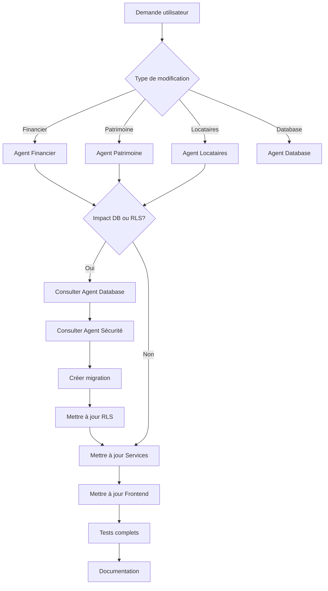

# CLAUDE.md - SaaS Gestion Locative

> Ce fichier sert de référence pour tout assistant IA travaillant sur ce projet.
> Dernière mise à jour : 6 Janvier 2026 - Conformité Légale Baux (Loi ALUR)

---

## ⚠️ RÈGLE ABSOLUE - MÉTHODOLOGIE DE MODIFICATION

**AVANT TOUTE MODIFICATION** dans ce projet, **vous DEVEZ** :

1. 📖 **Lire** [`METHODO_MODIFICATIONS.md`](./METHODO_MODIFICATIONS.md)
2. ✅ **Créer** un fichier `ANALYSE_IMPACT_[FEATURE].md`
3. 🔍 **Analyser** l'impact sur DB + RLS + Frontend
4. 📝 **Planifier** TOUS les scripts et modifications nécessaires
5. 🎯 **Exécuter** dans l'ordre : DB → RLS → Services → Formulaires → Tests

**JAMAIS de modification partielle. Toujours une approche systémique complète.**

➡️ Voir [`METHODO_MODIFICATIONS.md`](./METHODO_MODIFICATIONS.md) pour le détail complet.

---

## 📋 TABLE DES MATIÈRES

1. [Vision du projet](#-vision-du-projet)
2. [État actuel du projet](#-état-actuel-du-projet)
3. [Structure de menu](#-structure-de-menu)
4. [Architecture multi-entités](#-architecture-multi-entités)
5. [Stack technique](#️-stack-technique)
6. [Design System](#-design-system)
7. [Routes](#-routes)
8. [Composants UI](#-composants-ui)
9. [Sécurité et RLS](#-sécurité-et-rls)
10. [Roadmap](#-roadmap)
11. [Architecture des dossiers](#-architecture-des-dossiers)
12. [Schéma de base de données](#️-schéma-de-base-de-données)
13. [Variables d'environnement](#-variables-denvironnement)
14. [Commandes utiles](#-commandes-utiles)
15. [Directives pour les sous-agents](#-directives-pour-les-sous-agents)

---

## 🎯 VISION DU PROJET

### Description
Application web SaaS de gestion locative destinée aux propriétaires bailleurs français.
Permet de gérer les biens immobiliers, les locataires, les baux et le suivi des loyers.

### Proposition de valeur
- Simplifier la gestion locative pour les particuliers et investisseurs immobiliers
- Support multi-entités (SCI, SARL, LMNP, nom propre)
- Gestion granulaire : Entité → Propriété → Lot → Bail
- Conformité automatique avec la législation française (loi ALUR, RGPD)
- Interface intuitive accessible aux non-techniciens

### Modèle économique
| Plan | Prix | Limites |
|------|------|---------|
| Gratuit | 0€ | 1 entité, 2 lots maximum |
| Premium | 15€/mois | Entités illimitées, lots illimités, fonctionnalités avancées |
| Locataire | Toujours gratuit | Accès consultation uniquement |

---

## 📦 ÉTAT ACTUEL DU PROJET

### ✅ Composants UI créés (src/components/ui/)

| Composant | Description | Props principales |
|-----------|-------------|-------------------|
| **Button.jsx** | Bouton réutilisable avec variants | `variant`: primary, secondary, danger, success<br>`size`: sm, md, lg<br>`disabled`, `onClick` |
| **Card.jsx** | Carte conteneur avec titre optionnel | `title`, `subtitle`<br>`padding`: true/false<br>`children` |
| **Badge.jsx** | Badge de statut coloré | `variant`: success, danger, warning, info, default<br>`children` |
| **StatCard.jsx** | Carte de statistique avec icône | `title`, `value`, `subtitle`<br>`variant`: blue, emerald, indigo, red<br>`icon`, `href` |
| **Alert.jsx** | Message d'alerte | `variant`: info, success, warning, error<br>`title`, `children` |
| **Loading.jsx** | Indicateur de chargement | `message`: texte affiché<br>`fullScreen`: boolean pour plein écran |
| **Toast.jsx** ✨ | Notification toast animée | `id`, `message`, `type`: success/error/warning/info<br>`duration`, `onClose` |
| **ToastContainer.jsx** ✨ | Conteneur de toasts (top-right) | Aucune prop (utilise ToastContext) |
| **Modal.jsx** ✨ | Modale réutilisable avec overlay | `isOpen`, `onClose`, `title`, `children`<br>`size`: sm/md/lg/xl/full<br>`showCloseButton`, `closeOnOverlayClick` |
| **Dropdown.jsx** ✨ | Menu déroulant actions | `trigger`: élément déclencheur<br>`items`: array d'objets {label, icon, onClick, danger, disabled, divider}<br>`align`: left/right |
| **Breadcrumb.jsx** ✨ | Fil d'Ariane hiérarchique | `items`: array d'objets {label, href} |
| **Tabs.jsx** ✨ | Onglets de navigation | `tabs`: array d'objets {id, label, icon, badge, content, disabled}<br>`defaultTab`, `onChange` |
| **Skeleton.jsx** ✨ | Placeholders de chargement | `type`: text/title/avatar/card/button/image/table-row<br>`count`: nombre d'éléments<br>`className` |

### ✅ Composants métier créés

#### Composants entities (src/components/entities/)

| Composant | Description | Props principales |
|-----------|-------------|-------------------|
| **EntitySelect.jsx** ✨ | Sélecteur d'entité avec chargement auto | `value`: ID entité sélectionnée<br>`onChange`: callback<br>`required`: boolean<br>`label`: libellé<br>`placeholder`: texte placeholder |

#### Composants tenants (src/components/tenants/)

| Composant | Description | Props principales |
|-----------|-------------|-------------------|
| **TenantCard.jsx** ✨ | Carte d'affichage d'un locataire | `tenant`: objet locataire<br>`onEdit`, `onDelete` callbacks |
| **TenantGroupInfo.jsx** ✨ | Informations du groupe de locataires | `group`: objet groupe<br>`tenants`: array de locataires |
| **TenantDetailSections.jsx** ✨ | Sections pour page détail locataire | `Documents`, `Lease` composants exportés |
| **GuaranteeForm.jsx** ✨ | Formulaire garant/cautionnaire | `guarantee`: objet garant<br>`onSubmit`, `onCancel` callbacks |
| **GuaranteeCard.jsx** ✨ | Carte d'affichage d'un garant | `guarantee`: objet garant<br>`onEdit`, `onDelete` callbacks |
| **FinancialSummary.jsx** ✨ | Résumé financier locataire | `tenants`: array<br>`lease`: objet bail |

#### Composants candidates (src/components/candidates/)

| Composant | Description | Statut |
|-----------|-------------|--------|
| Composants candidatures | Formulaires et cartes candidats | ✅ Créés |

### ✅ Layout créé (src/components/layout/)

**DashboardLayout.jsx** - Layout principal de l'application
- **Fonctionnalités** :
  - Sidebar fixe avec navigation
  - Header avec titre de page et bouton profil/déconnexion
  - Zone de contenu responsive
  - Navigation active automatique (basée sur l'URL)
- **Props** :
  - `title` : Titre de la page affiché dans le header
  - `children` : Contenu de la page

### ✅ Pages implémentées (src/pages/)

#### Pages publiques (5)
- `Home.jsx` - Page d'accueil
- `Login.jsx` - Connexion
- `Register.jsx` - Inscription
- `PublicCandidateForm.jsx` ✨ - Formulaire candidature public (accessible via token)
- `CandidateStatus.jsx` ✨ - Suivi statut candidature

#### Pages principales (16)
| Page | Statut | Composants utilisés | Fonctionnalités |
|------|--------|---------------------|-----------------|
| `Dashboard.jsx` | ✅ | DashboardLayout, StatCard, Alert, Card | Stats globales, alertes échéances/impayés, actions rapides |
| `Entities.jsx` | ✅ | DashboardLayout, Button, Card | Liste entités juridiques, stats par entité |
| `EntityDetail.jsx` | ✅ | DashboardLayout, StatCard | Détail entité avec stats propriétés/lots/revenus |
| `Properties.jsx` | ✅ | DashboardLayout, Button, Badge, Card | Liste propriétés, filtres par entité |
| `PropertyDetail.jsx` | ✅ | DashboardLayout, Card | Détail propriété avec liste lots |
| `Lots.jsx` | ✅ | DashboardLayout, Button, Badge, Card | Liste lots, filtres entité/propriété, statuts |
| `LotDetail.jsx` | ✅ | DashboardLayout, Card, Badge | Détail lot avec bail actif et historique |
| `Tenants.jsx` | ✅ | DashboardLayout, Button, Card | Liste groupes locataires avec bail actif |
| `TenantDetail.jsx` | ✅ ✨ | DashboardLayout, Card, Badge, Alert | Détail groupe avec bail actif, taux effort, revenus membres |
| `Leases.jsx` | ✅ | DashboardLayout, Button, Badge, Card | Liste baux, statuts, périodes, montants |
| `LeaseDetail.jsx` | ✅ ✨ | DashboardLayout, Card, Badge, Alert | Détail bail avec loyer net (aides CAF), breadcrumb navigation |
| `Payments.jsx` | ✅ | DashboardLayout, Button, Badge, Card | Liste paiements, filtres statut, génération quittances PDF |
| `Indexation.jsx` | ✅ | DashboardLayout, Card, Alert | Révision loyers IRL, historique IRL, simulation |
| `Candidates.jsx` | ✅ | DashboardLayout, Button, Badge, Card | Liste candidatures, filtres statut |
| `CandidateDetail.jsx` | ✅ | DashboardLayout, Card | Détail candidature avec documents et scoring |
| `Profile.jsx` | ✅ | DashboardLayout, Button, Card | Modification profil utilisateur |
| `ComingSoon.jsx` | ✅ | DashboardLayout, Alert | Page placeholder fonctionnalités à venir |

#### Formulaires (8)
| Formulaire | Statut | Fonctionnalités |
|------------|--------|-----------------|
| `EntityForm.jsx` | ✅ | Création/édition entité juridique, infos légales |
| `PropertyForm.jsx` | ✅ | Création/édition propriété, sélecteur entité |
| `LotForm.jsx` | ✅ | Création/édition lot, sélecteur propriété, DPE |
| `TenantForm.jsx` | ✅ ✨ | Création/édition groupe locataires (individuel/couple/colocation)<br>**NOUVEAU** : Sélecteur EntitySelect intégré |
| `LeaseForm.jsx` | ✅ ✨ | Création/édition bail, sélecteur lot/locataire<br>**NOUVEAU** : Pré-remplissage CAF automatique + validation taux d'effort temps réel |
| `PaymentForm.jsx` | ✅ | Création/édition paiement, pré-remplissage montant |

**Note ✨** : Les éléments marqués ✨ sont nouveaux depuis la dernière mise à jour

### 🎨 Design System "Bold Geometric"

> Documentation complète : voir `DESIGN_SYSTEM_BOLD_GEOMETRIC.md`

Le design system "Bold Geometric" est caractérisé par des formes géométriques audacieuses, des couleurs vives, des effets glow, et une typographie moderne.

#### Couleurs principales (Variables CSS)

| Couleur | Variable | Valeur | Usage |
|---------|----------|--------|-------|
| **Electric Blue** | `--color-electric-blue` | `#0055FF` | Actions primaires, liens |
| **Vivid Coral** | `--color-vivid-coral` | `#FF6B4A` | Danger, suppression |
| **Lime** | `--color-lime` | `#C6F135` | Succès alternatif |
| **Purple** | `--color-purple` | `#8B5CF6` | Accents premium |
| **Success** | Emerald-500 | `#10B981` | Validations |
| **Warning** | Amber-500 | `#F59E0B` | Alertes |

#### Couleurs de surface

| Mode | Background | Surface | Border | Text |
|------|------------|---------|--------|------|
| **Clair** | `#F1F3F9` | `#FFFFFF` | `#E2E8F0` | `#1E293B` |
| **Sombre** | `#0A0A0F` | `#12121A` | `#2A2A3C` | `#F1F5F9` |

#### Typographie

| Niveau | Classes Tailwind | Police |
|--------|------------------|--------|
| **Display** | `font-display` | Space Grotesk |
| **Body** | `font-body` (défaut) | DM Sans |
| **H1** | `text-3xl font-display font-bold` | 30px |
| **H2** | `text-2xl font-display font-bold` | 24px |
| **H3** | `text-xl font-display font-semibold` | 20px |
| **Labels** | `text-sm font-display font-medium` | 14px |

#### Border Radius

| Élément | Tailwind | Valeur |
|---------|----------|--------|
| Inputs, Badges, Nav | `rounded-xl` | 12px |
| Cards, Modals | `rounded-2xl` | 16px |
| Avatars, Badges ronds | `rounded-full` | 9999px |

#### Effets Glow

```css
shadow-glow-blue   → hover sur boutons primaires
shadow-glow-coral  → hover sur boutons danger
shadow-glow-lime   → hover sur boutons success alternatif
shadow-glow-purple → hover sur boutons premium
```

#### Animations

| Animation | Classe | Usage |
|-----------|--------|-------|
| Fade In | `animate-fade-in` | Pages, modals |
| Slide Up | `animate-slide-up` | Cards, notifications |
| Card Enter | `animate-card-enter` | Listes de cards |

#### Composants standards

- **Inputs** : `px-4 py-3 bg-[var(--surface)] border border-[var(--border)] rounded-xl focus:ring-2 focus:ring-[var(--color-electric-blue)]`
- **Cards** : `bg-[var(--surface)] border border-[var(--border)] rounded-2xl p-6 hover:-translate-y-0.5 hover:shadow-card-hover`
- **Boutons** : Gradient + glow via composant Button (`hover:shadow-glow-blue`)
- **Tables headers** : `bg-[var(--surface-elevated)] text-xs font-display font-semibold uppercase`

#### Exemple de code

```jsx
// Titre de page
<h1 className="text-3xl font-display font-bold text-[var(--text)]">
  Dashboard
</h1>

// Card interactive
<div className="bg-[var(--surface)] border border-[var(--border)] rounded-2xl p-6
                transition-all duration-200 hover:-translate-y-0.5 hover:shadow-card-hover">
  Contenu
</div>

// Bouton primaire
<Button variant="primary" className="hover:shadow-glow-blue">
  Créer
</Button>
```

---

## 🧭 STRUCTURE DE MENU

### Navigation principale (Sidebar)

La sidebar de navigation est organisée par catégories fonctionnelles. Chaque item de menu indique son statut d'implémentation.

#### 📊 Tableau de bord
- ✅ **Dashboard** (`/dashboard`) - Vue d'ensemble avec statistiques globales

#### 🏛️ Patrimoine
- ✅ **Entités** (`/entities`) - Gestion des entités juridiques (SCI, SARL, LMNP...)
- ✅ **Propriétés** (`/properties`) - Gestion des immeubles et bâtiments
- ✅ **Lots** (`/lots`) - Gestion des unités locatives
- ✅ **Indexation IRL** (`/indexation`) - Révision automatique des loyers

#### 👥 Locataires
- ✅ **Liste locataires** (`/tenants`) - Gestion des locataires
- ✅ **Baux** (`/leases`) - Gestion des contrats de location
- 🔜 **Candidatures** (`/applications`) - Gestion des dossiers de candidature
- 🔜 **Portail locataire** (`/tenant-portal`) - Accès locataire (consultation, paiement en ligne)

#### 💰 Finances
- ✅ **Paiements** (`/payments`) - Suivi des loyers et quittances
- ✅ **Quittances** (intégré dans Paiements) - Génération PDF
- 🔜 **Charges** (`/charges`) - Gestion et régularisation des charges
- 🔜 **Comptabilité** (`/accounting`) - Exports comptables et fiscaux
- 🔜 **Déclaration fiscale** (`/tax-declaration`) - Aide déclaration 2044

#### 📄 Documents
- 🔜 **Bibliothèque** (`/documents`) - Tous les documents par catégorie
- 🔜 **États des lieux** (`/inventories`) - EDL entrée/sortie numériques
- 🔜 **Modèles** (`/templates`) - Modèles de documents légaux
- 🔜 **Signatures** (`/signatures`) - Suivi des signatures électroniques

#### 🔧 Interventions
- 🔜 **Demandes** (`/maintenance-requests`) - Demandes d'intervention locataires
- 🔜 **Interventions** (`/maintenance`) - Suivi des travaux et réparations
- 🔜 **Prestataires** (`/service-providers`) - Carnet d'adresses prestataires

#### 📨 Communication
- 🔜 **Messages** (`/messages`) - Messagerie interne
- 🔜 **Notifications** (`/notifications`) - Centre de notifications
- 🔜 **Historique emails** (`/email-history`) - Emails envoyés automatiquement
- 🔜 **Historique SMS** (`/sms-history`) - SMS envoyés (relances, alertes)

#### ⚙️ Paramètres
- ✅ **Profil** (`/profile`) - Informations personnelles
- 🔜 **Abonnement** (`/subscription`) - Plan et facturation
- 🔜 **Préférences** (`/preferences`) - Notifications, langue, etc.
- 🔜 **Sécurité** (`/security`) - Mot de passe, 2FA

### Légende
- ✅ **FAIT** : Fonctionnalité implémentée et opérationnelle
- 🔜 **À FAIRE** : Fonctionnalité planifiée dans la roadmap

---

## 🏗️ ARCHITECTURE MULTI-ENTITÉS (NOUVELLE)

### Vue d'ensemble

```
┌──────────────────────────────────────────────────────────────────┐
│                      UTILISATEUR (Bailleur)                       │
└────────────────────┬─────────────────────────────────────────────┘
                     │ 1:N
                     ▼
┌──────────────────────────────────────────────────────────────────┐
│              ENTITÉ JURIDIQUE (SCI, SARL, Nom propre...)         │
│  Gestion centralisée : comptabilité, TVA, documents légaux       │
└────────────────────┬─────────────────────────────────────────────┘
                     │ 1:N
                     ▼
┌──────────────────────────────────────────────────────────────────┐
│         PROPRIÉTÉ / IMMEUBLE (Bâtiment, Maison, Terrain...)      │
│  Immeuble entier, copropriété, syndic, valeur patrimoine         │
└────────────────────┬─────────────────────────────────────────────┘
                     │ 1:N
                     ▼
┌──────────────────────────────────────────────────────────────────┐
│           LOT / UNITÉ LOCATIVE (Appt, Parking, Cave...)          │
│  Unité louable : loyer, charges, DPE, équipements                │
└────────────────────┬─────────────────────────────────────────────┘
                     │ 1:N
                     ▼
┌──────────────────────────────────────────────────────────────────┐
│                   BAIL (Contrat de location)                      │
│  Lie un lot à un locataire, durée, montants, clauses             │
└────────────────────┬─────────────────────────────────────────────┘
                     │ 1:N
                     ▼
┌──────────────────────────────────────────────────────────────────┐
│                    PAIEMENTS (Loyers mensuels)                    │
│  Quittances, relances, historique des règlements                 │
└──────────────────────────────────────────────────────────────────┘
```

### Nouvelles tables SQL à créer

#### 1. Table `entities` (entités juridiques)
```sql
CREATE TYPE entity_type AS ENUM (
  'individual',        -- Nom propre
  'sci',              -- Société Civile Immobilière
  'sarl',             -- Société À Responsabilité Limitée
  'sas',              -- Société par Actions Simplifiée
  'sasu',             -- SAS Unipersonnelle
  'eurl',             -- SARL Unipersonnelle
  'lmnp',             -- Loueur Meublé Non Professionnel
  'lmp',              -- Loueur Meublé Professionnel
  'other'             -- Autre
);

CREATE TABLE entities (
  id UUID PRIMARY KEY DEFAULT uuid_generate_v4(),
  user_id UUID NOT NULL REFERENCES users(id) ON DELETE CASCADE,

  -- Informations générales
  name VARCHAR(255) NOT NULL,
  entity_type entity_type NOT NULL DEFAULT 'individual',

  -- Informations légales
  siren VARCHAR(9),
  siret VARCHAR(14),
  vat_number VARCHAR(20),
  rcs_city VARCHAR(100),
  capital DECIMAL(15,2),

  -- Coordonnées
  address VARCHAR(500),
  city VARCHAR(100),
  postal_code VARCHAR(10),
  country VARCHAR(100) DEFAULT 'France',
  email VARCHAR(255),
  phone VARCHAR(20),

  -- Paramètres
  logo_url VARCHAR(500),
  color VARCHAR(7) DEFAULT '#2563EB',
  vat_applicable BOOLEAN DEFAULT FALSE,
  default_entity BOOLEAN DEFAULT FALSE,

  -- Métadonnées
  created_at TIMESTAMP WITH TIME ZONE DEFAULT NOW(),
  updated_at TIMESTAMP WITH TIME ZONE DEFAULT NOW(),

  -- Contraintes
  UNIQUE(user_id, name)
);

CREATE INDEX idx_entities_user ON entities(user_id);
CREATE INDEX idx_entities_default ON entities(user_id, default_entity);
```

#### 2. Table `properties` (propriétés/immeubles) - REFONTE
```sql
CREATE TYPE property_category AS ENUM (
  'building',         -- Immeuble entier
  'house',            -- Maison individuelle
  'apartment',        -- Appartement (si propriété = 1 seul lot)
  'commercial',       -- Local commercial
  'office',           -- Bureau
  'land',             -- Terrain
  'parking',          -- Parking (si propriété = 1 seul lot)
  'other'             -- Autre
);

CREATE TABLE properties (
  id UUID PRIMARY KEY DEFAULT uuid_generate_v4(),
  entity_id UUID NOT NULL REFERENCES entities(id) ON DELETE CASCADE,

  -- Informations générales
  name VARCHAR(255) NOT NULL,
  category property_category NOT NULL DEFAULT 'building',

  -- Localisation
  address VARCHAR(500) NOT NULL,
  city VARCHAR(100) NOT NULL,
  postal_code VARCHAR(10) NOT NULL,
  country VARCHAR(100) DEFAULT 'France',

  -- Caractéristiques
  construction_year INTEGER,
  acquisition_date DATE,
  acquisition_price DECIMAL(15,2),
  current_value DECIMAL(15,2),

  -- Copropriété
  is_coproperty BOOLEAN DEFAULT FALSE,
  coproperty_lots INTEGER,
  syndic_name VARCHAR(255),
  syndic_email VARCHAR(255),
  syndic_phone VARCHAR(20),
  syndic_fees DECIMAL(10,2),

  -- Informations additionnelles
  description TEXT,
  notes TEXT,

  -- Métadonnées
  created_at TIMESTAMP WITH TIME ZONE DEFAULT NOW(),
  updated_at TIMESTAMP WITH TIME ZONE DEFAULT NOW(),

  UNIQUE(entity_id, name)
);

CREATE INDEX idx_properties_entity ON properties(entity_id);
```

#### 3. Table `lots` (unités locatives) - NOUVELLE
```sql
CREATE TYPE lot_type AS ENUM (
  'apartment',        -- Appartement
  'studio',           -- Studio
  'house',            -- Maison
  'commercial',       -- Local commercial
  'office',           -- Bureau
  'parking',          -- Parking
  'cellar',           -- Cave
  'storage',          -- Débarras/Box
  'land',             -- Terrain
  'other'             -- Autre
);

CREATE TYPE lot_status AS ENUM (
  'vacant',           -- Vacant
  'occupied',         -- Occupé
  'unavailable',      -- Indisponible (travaux, vente...)
  'for_sale'          -- En vente
);

CREATE TABLE lots (
  id UUID PRIMARY KEY DEFAULT uuid_generate_v4(),
  property_id UUID NOT NULL REFERENCES properties(id) ON DELETE CASCADE,

  -- Informations générales
  name VARCHAR(255) NOT NULL,
  reference VARCHAR(50),
  lot_type lot_type NOT NULL DEFAULT 'apartment',
  status lot_status NOT NULL DEFAULT 'vacant',

  -- Localisation dans la propriété
  floor INTEGER,
  door_number VARCHAR(20),

  -- Caractéristiques
  surface_area DECIMAL(10,2),
  nb_rooms INTEGER,
  nb_bedrooms INTEGER,
  nb_bathrooms INTEGER,

  -- Montants
  rent_amount DECIMAL(10,2) NOT NULL,
  charges_amount DECIMAL(10,2) DEFAULT 0,
  deposit_amount DECIMAL(10,2),

  -- Équipements
  furnished BOOLEAN DEFAULT FALSE,
  has_parking BOOLEAN DEFAULT FALSE,
  has_cellar BOOLEAN DEFAULT FALSE,
  has_balcony BOOLEAN DEFAULT FALSE,
  has_terrace BOOLEAN DEFAULT FALSE,
  has_garden BOOLEAN DEFAULT FALSE,
  has_elevator BOOLEAN DEFAULT FALSE,

  -- Énergie
  heating_type VARCHAR(100),
  dpe_rating VARCHAR(1),
  dpe_value INTEGER,
  dpe_date DATE,
  ges_rating VARCHAR(1),
  ges_value INTEGER,

  -- Copropriété (si applicable)
  coproperty_lot_number VARCHAR(50),
  coproperty_tantieme INTEGER,

  -- Informations additionnelles
  description TEXT,
  notes TEXT,

  -- Métadonnées
  created_at TIMESTAMP WITH TIME ZONE DEFAULT NOW(),
  updated_at TIMESTAMP WITH TIME ZONE DEFAULT NOW(),

  UNIQUE(property_id, reference)
);

CREATE INDEX idx_lots_property ON lots(property_id);
CREATE INDEX idx_lots_status ON lots(status);
```

#### 4. Modifications des tables existantes

```sql
-- Table tenants : ajouter la relation avec l'entité
ALTER TABLE tenants ADD COLUMN entity_id UUID REFERENCES entities(id) ON DELETE CASCADE;
CREATE INDEX idx_tenants_entity ON tenants(entity_id);

-- Table leases : remplacer property_id par lot_id
ALTER TABLE leases DROP COLUMN property_id;
ALTER TABLE leases ADD COLUMN lot_id UUID NOT NULL REFERENCES lots(id) ON DELETE CASCADE;
CREATE INDEX idx_leases_lot ON leases(lot_id);

-- Table documents : ajouter les relations multi-niveaux
ALTER TABLE documents ADD COLUMN entity_id UUID REFERENCES entities(id);
ALTER TABLE documents ADD COLUMN property_id UUID REFERENCES properties(id);
ALTER TABLE documents ADD COLUMN lot_id UUID REFERENCES lots(id);
CREATE INDEX idx_documents_entity ON documents(entity_id);
CREATE INDEX idx_documents_property ON documents(property_id);
CREATE INDEX idx_documents_lot ON documents(lot_id);
```

### Nouvelles routes frontend à créer

#### Routes Entités
```
/entities              → Liste des entités juridiques
/entities/new          → Créer une nouvelle entité
/entities/:id          → Détail entité avec stats (revenus, taux occupation, rendement)
/entities/:id/edit     → Modifier une entité
/entities/:id/settings → Paramètres avancés (TVA, logo, couleur)
```

#### Routes Propriétés (refonte)
```
/properties            → Liste des propriétés (filtrable par entité)
/properties/new        → Créer une propriété
/properties/:id        → Détail propriété avec liste des lots
/properties/:id/edit   → Modifier une propriété
/properties/:id/lots   → Gérer les lots de la propriété
```

#### Routes Lots (nouvelles)
```
/lots                  → Liste de tous les lots (filtrable par entité/propriété)
/lots/new              → Créer un nouveau lot
/lots/:id              → Détail lot avec bail actif, historique, documents
/lots/:id/edit         → Modifier un lot
```

### Fonctionnalités à implémenter

#### 1. Sélecteur d'entité global
- Dans la sidebar du DashboardLayout
- Dropdown avec liste des entités + option "Toutes les entités"
- Filtre automatique toutes les vues (dashboard, biens, baux, paiements)
- Stockage de la sélection dans le localStorage

#### 2. Statistiques par entité
- **Revenus mensuels** : Somme des loyers des baux actifs
- **Taux d'occupation** : (Lots occupés / Total lots) × 100
- **Rendement brut** : (Revenus annuels / Valeur patrimoine) × 100
- **Impayés** : Total des paiements en retard
- **Nombre de propriétés**
- **Nombre de lots**
- **Nombre de locataires**

#### 3. Dashboard multi-entités
- **Vue globale** : Toutes entités confondues
- **Vue filtrée** : Une entité spécifique
- **Comparaison** : Tableau comparatif entre entités
- **Graphiques** :
  - Répartition revenus par entité (pie chart)
  - Évolution revenus mensuels (line chart)
  - Taux occupation par entité (bar chart)

#### 4. Gestion hiérarchique
- Fil d'Ariane : Entité > Propriété > Lot > Bail
- Navigation contextuelle avec retour au niveau supérieur
- Icônes et couleurs par niveau hiérarchique

---

## 🛠️ STACK TECHNIQUE

### Frontend
```
Framework      : React 18+
Build tool     : Vite 7.3
Styling        : TailwindCSS V3
Routing        : React Router v6
State          : Context API + useState
HTTP Client    : Supabase Client
PDF Generation : jsPDF
Hébergement    : Vercel
```

### Backend
```
Backend-as-a-Service : Supabase
Database             : PostgreSQL (via Supabase)
Auth                 : Supabase Auth
Storage              : Supabase Storage
Real-time            : Supabase Realtime (à utiliser)
Edge Functions       : Supabase Functions (à utiliser)
```

### Services futurs
```
Email          : Resend ou SendGrid
Paiements      : Stripe
Signature élec : Yousign
Connexion banc : Bridge ou Plaid
```

---

## 🔐 SÉCURITÉ ET RLS

### État Actuel (4 Janvier 2026)

**Score Sécurité** : ✅ **100/100** (Production-Ready)

| Critère | Score | Statut |
|---------|-------|--------|
| **RLS** | 100/100 | ✅ V2 Complète (60+ policies, 13 tables) |
| **Rate Limiting** | 100/100 | ✅ Activé sur routes sensibles |
| **Architecture** | 100/100 | ✅ Mapping correct auth → users |
| **Documentation** | 100/100 | ✅ Complète |

### RLS V2 - Architecture Complète

**Mapping d'authentification** :
```
auth.uid() (Supabase Auth)
    ↓
users.supabase_uid
    ↓
users.id
    ↓
entities.user_id
```

**Helper Functions** :
- `get_app_user_id()` : Convertit auth.uid() → users.id
- `user_owns_entity(entity_uuid)` : Vérifie ownership entité
- `user_owns_property(property_uuid)` : Vérifie ownership propriété
- `user_owns_lot(lot_uuid)` : Vérifie ownership lot
- `user_owns_tenant(tenant_uuid)` : Vérifie ownership locataire

**Tables Protégées** (13 tables) :
1. ✅ `entities` - 4 policies (propriétaire uniquement)
2. ✅ `properties_new` - 4 policies (via entity ownership)
3. ✅ `lots` - 4 policies (via property ownership)
4. ✅ `tenants` - 4 policies + trigger auto user_id
5. ✅ `leases` - 4 policies (via lot ownership)
6. ✅ `payments` - 4 policies (via lease ownership)
7. ✅ `candidates` - 5 policies (4 propriétaire + 1 publique via lien invitation)
8. ✅ `candidate_documents` - 3 policies (2 propriétaire + 1 publique upload)
9. ✅ `candidate_invitation_links` - 2 policies (1 propriétaire + 1 publique lecture)
10. ✅ `tenant_documents` - 3 policies (propriétaire uniquement)
11. ✅ `irl_history` - 1 policy (lecture publique authentifiée - données INSEE)
12. ✅ `indexation_history` - 4 policies (propriétaire via lease)
13. ✅ `tenant_groups` - 4 policies (via entity ownership)
14. ✅ `guarantees` - 4 policies (via tenant ownership)
15. ✅ `users` - 2 policies (self-service)

**Total** : **60+ policies** actives

### Fonctionnalités Sécurisées

#### 1. Formulaire Public Candidature ✅
- Accès public sécurisé via lien d'invitation
- Validation automatique lien actif et non expiré
- Upload documents candidature autorisé
- Isolation totale entre propriétaires

#### 2. Multi-Tenant Strict ✅
- Isolation complète des données par utilisateur
- Impossible de voir/modifier données d'un autre utilisateur
- Vérification ownership à chaque niveau hiérarchique

#### 3. Rate Limiting ✅
- Protection contre attaques par force brute
- Limites configurées sur routes sensibles
- Headers `X-RateLimit-*` dans les réponses

### Scripts de Migration

**Fichiers Clés** :
- `supabase/migrations/20260104_CLEANUP_OLD_RLS.sql` - Nettoyage ancien RLS
- `supabase/migrations/20260104_RLS_CORRECT_FINAL_v2.sql` - RLS V2 complet
- `supabase/migrations/20260104_RESTORE_DATA_FINAL.sql` - Restauration données
- `supabase/migrations/20260104_FIX_TENANTS_URGENT.sql` - Fix user_id tenants

**Documentation** :
- `EXECUTION_RLS_ETAPE_PAR_ETAPE.md` - Guide exécution migration
- `RLS_V2_CHANGELOG.md` - Différences V1 vs V2
- `GUIDE_RLS_FINAL.md` - Guide complet RLS

### Triggers Automatiques

```sql
-- Trigger : Remplissage automatique user_id dans tenants
CREATE TRIGGER set_tenant_user_id_trigger
  BEFORE INSERT OR UPDATE ON tenants
  FOR EACH ROW
  EXECUTE FUNCTION set_tenant_user_id();
```

**Fonction** : Remplit automatiquement `user_id` avec l'utilisateur connecté si non fourni.

### Tests de Validation

Pour vérifier l'isolation multi-tenant :

1. Créer un 2ème compte utilisateur
2. Se connecter avec ce nouveau compte
3. Vérifier : **Aucune donnée** du 1er utilisateur visible ✅

### Conformité RGPD

- ✅ Isolation données par utilisateur
- ✅ RLS empêche accès non autorisé
- ✅ Pas de fuite de données entre utilisateurs
- ✅ Triggers automatiques pour intégrité

---

## 🎨 DESIGN SYSTEM

### Composants UI disponibles

#### Button
```jsx
import Button from '../components/ui/Button'

<Button variant="primary" size="lg" onClick={handleClick}>
  Créer un bien
</Button>

// Variants: primary, secondary, danger, success, outline
// Sizes: sm, md, lg
```

#### Card
```jsx
import Card from '../components/ui/Card'

<Card title="Titre" subtitle="Sous-titre">
  Contenu de la carte
</Card>

// Props: title, subtitle, padding (true/false), className
```

#### Badge
```jsx
import Badge from '../components/ui/Badge'

<Badge variant="success">Actif</Badge>

// Variants: success, danger, warning, info, default
```

#### StatCard
```jsx
import StatCard from '../components/ui/StatCard'

<StatCard
  title="Revenus mensuels"
  value="3 450 €"
  subtitle="Voir détails →"
  variant="indigo"
  href="/payments"
  icon={<svg>...</svg>}
/>

// Variants: blue, emerald, indigo, red
```

#### Alert
```jsx
import Alert from '../components/ui/Alert'

<Alert variant="warning" title="Attention">
  3 baux arrivent à échéance dans les 30 prochains jours
</Alert>

// Variants: info, success, warning, error
```

#### Toast (Notifications) ✨ NOUVEAU
```jsx
import { useToast } from '../context/ToastContext'

function MyComponent() {
  const { showToast, success, error, warning, info } = useToast()

  const handleSave = async () => {
    try {
      await saveData()
      success('Données sauvegardées avec succès')
      // ou showToast({ message: 'Données sauvegardées', type: 'success', duration: 3000 })
    } catch (err) {
      error('Erreur lors de la sauvegarde')
    }
  }

  return <Button onClick={handleSave}>Sauvegarder</Button>
}

// Méthodes disponibles :
// - success(message, duration = 5000)
// - error(message, duration = 5000)
// - warning(message, duration = 5000)
// - info(message, duration = 5000)
// - showToast({ message, type, duration })
```

#### Modal ✨ NOUVEAU
```jsx
import { useState } from 'react'
import Modal from '../components/ui/Modal'
import Button from '../components/ui/Button'

function MyComponent() {
  const [isOpen, setIsOpen] = useState(false)

  return (
    <>
      <Button onClick={() => setIsOpen(true)}>Ouvrir</Button>

      <Modal
        isOpen={isOpen}
        onClose={() => setIsOpen(false)}
        title="Confirmer la suppression"
        size="md"
      >
        <p>Êtes-vous sûr de vouloir supprimer cet élément ?</p>
        <div className="flex gap-3 mt-4">
          <Button variant="danger" onClick={handleDelete}>Supprimer</Button>
          <Button variant="secondary" onClick={() => setIsOpen(false)}>Annuler</Button>
        </div>
      </Modal>
    </>
  )
}

// Sizes: sm, md, lg, xl, full
```

#### Dropdown ✨ NOUVEAU
```jsx
import Dropdown from '../components/ui/Dropdown'
import { Edit, Trash2, Eye } from 'lucide-react'
import Button from '../components/ui/Button'

<Dropdown
  trigger={<Button>Actions</Button>}
  items={[
    {
      label: 'Voir détail',
      icon: <Eye className="w-4 h-4" />,
      onClick: () => navigate('/detail')
    },
    {
      label: 'Modifier',
      icon: <Edit className="w-4 h-4" />,
      onClick: handleEdit
    },
    { divider: true },
    {
      label: 'Supprimer',
      icon: <Trash2 className="w-4 h-4" />,
      onClick: handleDelete,
      danger: true
    }
  ]}
  align="right"
/>

// align: left ou right
```

#### Breadcrumb ✨ NOUVEAU
```jsx
import Breadcrumb from '../components/ui/Breadcrumb'

<Breadcrumb
  items={[
    { label: 'Entités', href: '/entities' },
    { label: 'SCI Famille', href: '/entities/123' },
    { label: 'Immeuble Paris', href: '/properties/456' },
    { label: 'Lot A3' } // Dernier élément sans href
  ]}
/>
```

#### Tabs ✨ NOUVEAU
```jsx
import Tabs from '../components/ui/Tabs'

<Tabs
  defaultTab="details"
  tabs={[
    {
      id: 'details',
      label: 'Détails',
      icon: <InfoIcon />,
      badge: '3',
      content: <DetailsContent />
    },
    {
      id: 'payments',
      label: 'Paiements',
      content: <PaymentsContent />
    },
    {
      id: 'documents',
      label: 'Documents',
      disabled: true,
      content: <DocumentsContent />
    }
  ]}
  onChange={(tabId) => console.log('Active tab:', tabId)}
/>
```

#### Skeleton ✨ NOUVEAU
```jsx
import Skeleton from '../components/ui/Skeleton'

// Chargement de texte
<Skeleton type="text" count={3} />

// Chargement de titre
<Skeleton type="title" />

// Chargement de carte
<Skeleton type="card" count={2} />

// Chargement de table
<Skeleton type="table-row" count={5} />

// Chargement d'avatar
<Skeleton type="avatar" />

// Types: text, title, avatar, card, button, image, table-row
```

#### DashboardLayout
```jsx
import DashboardLayout from '../components/layout/DashboardLayout'

function MyPage() {
  return (
    <DashboardLayout title="Ma page">
      {/* Contenu */}
    </DashboardLayout>
  )
}
```

### Conventions de code

#### Nomenclature
- **Composants React** : PascalCase (Button.jsx, StatCard.jsx)
- **Hooks** : camelCase avec préfixe use (useAuth.js, useEntities.js)
- **Services** : camelCase (entityService.js, propertyService.js)
- **Pages** : PascalCase (Dashboard.jsx, Properties.jsx)
- **Utilitaires** : camelCase (formatDate.js, calculateRate.js)

#### Structure des composants
```jsx
// 1. Imports
import { useState, useEffect } from 'react'
import { useNavigate } from 'react-router-dom'
import DashboardLayout from '../components/layout/DashboardLayout'
import Button from '../components/ui/Button'

// 2. Composant
function MyComponent() {
  // 3. Hooks
  const navigate = useNavigate()
  const [data, setData] = useState([])

  // 4. useEffect
  useEffect(() => {
    fetchData()
  }, [])

  // 5. Fonctions
  const fetchData = async () => {
    // ...
  }

  // 6. Render
  return (
    <DashboardLayout title="Mon composant">
      {/* JSX */}
    </DashboardLayout>
  )
}

// 7. Export
export default MyComponent
```

#### Classes Tailwind
- Utiliser uniquement les utility classes
- Ordre : layout → spacing → sizing → typography → colors → effects
- Responsive : mobile-first (sm:, md:, lg:, xl:)
- Hover et focus : hover:, focus:

```jsx
// Exemple d'input
<input
  type="text"
  className="w-full px-3 py-2 border border-gray-300 rounded-lg focus:outline-none focus:ring-2 focus:ring-blue-500 focus:border-transparent"
/>
```

---

## 🛣️ ROUTES À CRÉER

### Routes existantes ✅ FAIT

#### Authentification
- ✅ `/` - Page d'accueil publique
- ✅ `/login` - Connexion
- ✅ `/register` - Inscription

#### Dashboard
- ✅ `/dashboard` - Tableau de bord principal

#### Patrimoine
- ✅ `/entities` - Liste des entités
- ✅ `/entities/new` - Créer une entité
- ✅ `/entities/:id` - Détail d'une entité
- ✅ `/entities/:id/edit` - Modifier une entité
- ✅ `/properties` - Liste des propriétés
- ✅ `/properties/new` - Créer une propriété
- ✅ `/properties/:id/edit` - Modifier une propriété
- ✅ `/lots` - Liste des lots
- ✅ `/lots/new` - Créer un lot
- ✅ `/lots/:id/edit` - Modifier un lot
- ✅ `/indexation` - Indexation IRL

#### Locataires et baux
- ✅ `/tenants` - Liste des locataires
- ✅ `/tenants/new` - Créer un locataire
- ✅ `/tenants/:id/edit` - Modifier un locataire
- ✅ `/leases` - Liste des baux
- ✅ `/leases/new` - Créer un bail
- ✅ `/leases/:id/edit` - Modifier un bail

#### Finances
- ✅ `/payments` - Liste des paiements
- ✅ `/payments/new` - Enregistrer un paiement
- ✅ `/payments/:id/edit` - Modifier un paiement

#### Paramètres
- ✅ `/profile` - Profil utilisateur

### Routes à créer 🔜 À FAIRE

#### Patrimoine (détails)
- 🔜 `/properties/:id` - Page détail propriété avec liste des lots
- 🔜 `/lots/:id` - Page détail lot avec bail actif et historique

#### Candidatures
- 🔜 `/applications` - Liste des candidatures
- 🔜 `/applications/new` - Nouvelle candidature
- 🔜 `/applications/:id` - Détail candidature avec documents
- 🔜 `/applications/:id/review` - Évaluation candidature

#### Portail locataire
- 🔜 `/tenant-portal` - Dashboard locataire (consultation uniquement)
- 🔜 `/tenant-portal/lease` - Mon bail
- 🔜 `/tenant-portal/payments` - Mes paiements et quittances
- 🔜 `/tenant-portal/documents` - Mes documents
- 🔜 `/tenant-portal/maintenance` - Mes demandes d'intervention
- 🔜 `/tenant-portal/profile` - Mon profil

#### Finances avancées
- 🔜 `/charges` - Gestion des charges
- 🔜 `/charges/new` - Enregistrer une charge
- 🔜 `/charges/:id/edit` - Modifier une charge
- 🔜 `/charges/reconciliation` - Régularisation annuelle des charges
- 🔜 `/accounting` - Comptabilité et exports
- 🔜 `/accounting/export` - Export comptable (CSV, Excel)
- 🔜 `/tax-declaration` - Aide déclaration fiscale 2044
- 🔜 `/tax-declaration/preview` - Aperçu déclaration

#### Documents
- 🔜 `/documents` - Bibliothèque de documents
- 🔜 `/documents/upload` - Upload multiple de documents
- 🔜 `/inventories` - États des lieux
- 🔜 `/inventories/new` - Créer un état des lieux
- 🔜 `/inventories/:id` - Détail état des lieux avec photos
- 🔜 `/inventories/:id/edit` - Modifier état des lieux
- 🔜 `/inventories/:id/compare` - Comparer entrée/sortie
- 🔜 `/templates` - Modèles de documents
- 🔜 `/templates/:type/generate` - Générer un document
- 🔜 `/signatures` - Suivi des signatures électroniques
- 🔜 `/signatures/:id` - Détail signature

#### Interventions
- 🔜 `/maintenance-requests` - Demandes d'intervention
- 🔜 `/maintenance-requests/new` - Nouvelle demande
- 🔜 `/maintenance-requests/:id` - Détail demande
- 🔜 `/maintenance` - Suivi des interventions
- 🔜 `/maintenance/new` - Planifier une intervention
- 🔜 `/maintenance/:id` - Détail intervention
- 🔜 `/maintenance/:id/edit` - Modifier intervention
- 🔜 `/service-providers` - Carnet d'adresses prestataires
- 🔜 `/service-providers/new` - Ajouter un prestataire
- 🔜 `/service-providers/:id/edit` - Modifier un prestataire

#### Communication
- 🔜 `/messages` - Messagerie interne
- 🔜 `/messages/compose` - Nouveau message
- 🔜 `/messages/:id` - Conversation
- 🔜 `/notifications` - Centre de notifications
- 🔜 `/email-history` - Historique emails envoyés
- 🔜 `/sms-history` - Historique SMS envoyés

#### Paramètres
- 🔜 `/subscription` - Plan et facturation
- 🔜 `/subscription/upgrade` - Passer à Premium
- 🔜 `/preferences` - Préférences utilisateur
- 🔜 `/security` - Sécurité et 2FA

#### Diagnostics et conformité
- 🔜 `/diagnostics` - Gestion des diagnostics immobiliers
- 🔜 `/diagnostics/new` - Ajouter un diagnostic
- 🔜 `/diagnostics/:id/edit` - Modifier un diagnostic
- 🔜 `/diagnostics/alerts` - Alertes diagnostics expirés

---

## 🎨 COMPOSANTS UI À CRÉER

### Composants layout

#### Sidebar.jsx 🔜
Navigation latérale avec menu hiérarchique et sélecteur d'entité.
```jsx
<Sidebar
  currentEntity={selectedEntity}
  onEntityChange={handleEntityChange}
  entities={userEntities}
/>
```

**Props** :
- `currentEntity` : Entité actuellement sélectionnée
- `onEntityChange` : Callback changement d'entité
- `entities` : Liste des entités de l'utilisateur
- `activeRoute` : Route active pour highlighting

**Fonctionnalités** :
- Menu hiérarchique avec catégories collapsibles
- Sélecteur d'entité en haut (dropdown)
- Indicateur visuel route active
- Responsive (collapse sur mobile)

#### Breadcrumb.jsx 🔜
Fil d'Ariane pour navigation hiérarchique.
```jsx
<Breadcrumb items={[
  { label: 'Entités', href: '/entities' },
  { label: 'SCI Famille', href: '/entities/123' },
  { label: 'Immeuble Paris 15', href: '/properties/456' },
  { label: 'Appt 3A', href: '/lots/789' }
]} />
```

#### EmptyState.jsx 🔜
État vide avec icône et call-to-action.
```jsx
<EmptyState
  icon={<BuildingIcon />}
  title="Aucune propriété"
  description="Commencez par ajouter votre première propriété"
  action={<Button href="/properties/new">Ajouter une propriété</Button>}
/>
```

#### ComingSoon.jsx 🔜
Page placeholder pour fonctionnalités à venir.
```jsx
<ComingSoon
  feature="Portail locataire"
  description="Accès consultation pour vos locataires"
  estimatedDate="Q2 2025"
/>
```

### Composants de formulaire

#### FileUpload.jsx 🔜
Upload de fichiers avec drag & drop et preview.
```jsx
<FileUpload
  multiple={true}
  accept="image/*,application/pdf"
  maxSize={10} // Mo
  onUpload={handleUpload}
  preview={true}
/>
```

**Fonctionnalités** :
- Drag & drop
- Preview images et PDF
- Barre de progression upload
- Validation taille et type
- Support multiple fichiers

#### DateRangePicker.jsx 🔜
Sélecteur de plage de dates.
```jsx
<DateRangePicker
  startDate={startDate}
  endDate={endDate}
  onChange={handleDateChange}
  minDate={new Date()}
/>
```

#### AutoComplete.jsx 🔜
Input avec autocomplétion.
```jsx
<AutoComplete
  placeholder="Rechercher un locataire..."
  options={tenants}
  onSelect={handleSelect}
  displayKey="full_name"
  searchKeys={['full_name', 'email']}
/>
```

#### RichTextEditor.jsx 🔜
Éditeur de texte enrichi pour notes et descriptions.
```jsx
<RichTextEditor
  value={content}
  onChange={setContent}
  placeholder="Ajouter des notes..."
  toolbar={['bold', 'italic', 'list', 'link']}
/>
```

### Composants de données

#### DataTable.jsx 🔜
Tableau avancé avec tri, filtres, pagination.
```jsx
<DataTable
  columns={columns}
  data={data}
  sortable={true}
  filterable={true}
  pagination={true}
  pageSize={20}
  onRowClick={handleRowClick}
  actions={rowActions}
/>
```

**Fonctionnalités** :
- Tri multi-colonnes
- Filtres par colonne
- Pagination côté client/serveur
- Sélection lignes (checkbox)
- Actions par ligne (dropdown)
- Export CSV/Excel
- Responsive (scroll horizontal sur mobile)

#### StatChart.jsx 🔜
Graphiques statistiques (line, bar, pie).
```jsx
<StatChart
  type="line"
  data={revenueData}
  xKey="month"
  yKey="amount"
  title="Évolution des revenus"
  color="blue"
/>
```

**Types supportés** :
- `line` : Graphique en ligne
- `bar` : Graphique en barres
- `pie` : Camembert
- `area` : Aire

#### Timeline.jsx 🔜
Chronologie d'événements.
```jsx
<Timeline events={[
  { date: '2024-01-15', type: 'lease_start', description: 'Début du bail' },
  { date: '2024-02-01', type: 'payment', description: 'Paiement loyer janvier' },
  { date: '2024-03-01', type: 'indexation', description: 'Révision loyer IRL' }
]} />
```

#### ProgressBar.jsx 🔜
Barre de progression.
```jsx
<ProgressBar
  value={75}
  max={100}
  label="Taux d'occupation"
  color="emerald"
  showPercentage={true}
/>
```

### Composants métier

#### LeaseCard.jsx 🔜
Carte récapitulative d'un bail.
```jsx
<LeaseCard
  lease={lease}
  showTenant={true}
  showProperty={true}
  onViewDetails={() => navigate(`/leases/${lease.id}`)}
/>
```

**Affiche** :
- Locataire avec photo
- Propriété et lot
- Dates bail (début, fin, durée restante)
- Montant loyer + charges
- Statut (actif, terminé, à renouveler)
- Actions rapides (voir détails, générer quittance)

#### PaymentStatusBadge.jsx 🔜
Badge statut paiement avec logique métier.
```jsx
<PaymentStatusBadge
  payment={payment}
  showDaysLate={true}
/>
```

**Statuts** :
- `paid` : Payé (vert)
- `pending` : En attente (orange)
- `late` : En retard (rouge)
- `partial` : Partiel (jaune)

#### TenantAvatar.jsx 🔜
Avatar locataire avec fallback initiales.
```jsx
<TenantAvatar
  tenant={tenant}
  size="lg"
  showName={true}
/>
```

#### PropertyTypeIcon.jsx 🔜
Icône selon type de propriété/lot.
```jsx
<PropertyTypeIcon
  type="apartment"
  size={24}
  color="blue"
/>
```

**Types** :
- `apartment` : Appartement
- `house` : Maison
- `studio` : Studio
- `parking` : Parking
- `commercial` : Local commercial
- `office` : Bureau

### Composants de feedback

#### Modal.jsx 🔜
Modal réutilisable.
```jsx
<Modal
  isOpen={isOpen}
  onClose={handleClose}
  title="Confirmer la suppression"
  size="md"
>
  <p>Êtes-vous sûr de vouloir supprimer ce bail ?</p>
  <div className="flex gap-3 mt-4">
    <Button variant="danger" onClick={handleDelete}>Supprimer</Button>
    <Button variant="secondary" onClick={handleClose}>Annuler</Button>
  </div>
</Modal>
```

**Sizes** : `sm`, `md`, `lg`, `xl`, `full`

#### Toast.jsx 🔜
Notifications toast (success, error, warning, info).
```jsx
// Usage via hook
const { showToast } = useToast()
showToast({
  type: 'success',
  message: 'Le bail a été créé avec succès',
  duration: 3000
})
```

#### Spinner.jsx 🔜
Indicateur de chargement.
```jsx
<Spinner size="lg" color="blue" />
```

#### Skeleton.jsx 🔜
Placeholder chargement (skeleton screens).
```jsx
<Skeleton type="card" count={3} />
<Skeleton type="text" lines={4} />
<Skeleton type="avatar" size="lg" />
```

### Composants utilitaires

#### Tooltip.jsx 🔜
Info-bulle au survol.
```jsx
<Tooltip content="Le loyer révisé selon l'IRL">
  <InfoIcon />
</Tooltip>
```

#### Dropdown.jsx 🔜
Menu déroulant réutilisable.
```jsx
<Dropdown
  trigger={<Button>Actions</Button>}
  items={[
    { label: 'Modifier', onClick: handleEdit, icon: <EditIcon /> },
    { label: 'Supprimer', onClick: handleDelete, icon: <TrashIcon />, danger: true }
  ]}
/>
```

#### Tabs.jsx 🔜
Onglets de navigation.
```jsx
<Tabs defaultTab="details">
  <Tab id="details" label="Détails">
    <LeaseDetails lease={lease} />
  </Tab>
  <Tab id="payments" label="Paiements">
    <PaymentsList leaseId={lease.id} />
  </Tab>
  <Tab id="documents" label="Documents">
    <DocumentsList leaseId={lease.id} />
  </Tab>
</Tabs>
```

#### Pagination.jsx 🔜
Composant de pagination.
```jsx
<Pagination
  currentPage={currentPage}
  totalPages={totalPages}
  onPageChange={setCurrentPage}
  showPageNumbers={5}
/>
```

---

## 🚀 FUTURES FONCTIONNALITÉS DÉTAILLÉES

### 1. Candidatures (Espace candidat)

#### Fonctionnalités
- **Formulaire candidature en ligne** : Lien public partageable par le bailleur
- **Upload documents** : Pièce d'identité, justificatifs revenus, garants
- **Calcul automatique taux d'effort** : (Loyer / Revenus nets) × 100
- **Scoring automatique** : Note sur 100 basée sur critères (revenus, stabilité, garants)
- **Workflow validation** : Candidature → En cours → Acceptée/Refusée
- **Historique candidatures** : Archive pour chaque lot

#### Tables SQL à créer
```sql
CREATE TYPE application_status AS ENUM (
  'submitted',      -- Soumise
  'under_review',   -- En cours d'examen
  'accepted',       -- Acceptée
  'rejected',       -- Refusée
  'withdrawn'       -- Retirée par le candidat
);

CREATE TABLE applications (
  id UUID PRIMARY KEY DEFAULT uuid_generate_v4(),
  lot_id UUID NOT NULL REFERENCES lots(id) ON DELETE CASCADE,
  entity_id UUID NOT NULL REFERENCES entities(id) ON DELETE CASCADE,

  -- Informations candidat
  first_name VARCHAR(100) NOT NULL,
  last_name VARCHAR(100) NOT NULL,
  email VARCHAR(255) NOT NULL,
  phone VARCHAR(20),
  birth_date DATE,

  -- Situation professionnelle
  employment_type VARCHAR(100),
  employer_name VARCHAR(255),
  job_title VARCHAR(255),
  employment_start_date DATE,
  monthly_income DECIMAL(10,2),

  -- Garants
  has_guarantor BOOLEAN DEFAULT FALSE,
  guarantor_first_name VARCHAR(100),
  guarantor_last_name VARCHAR(100),
  guarantor_email VARCHAR(255),
  guarantor_phone VARCHAR(20),
  guarantor_monthly_income DECIMAL(10,2),

  -- Scoring
  score INTEGER CHECK (score >= 0 AND score <= 100),
  income_to_rent_ratio DECIMAL(5,2),

  -- Statut
  status application_status DEFAULT 'submitted',
  reviewed_at TIMESTAMP WITH TIME ZONE,
  reviewed_by UUID REFERENCES users(id),
  rejection_reason TEXT,

  -- Métadonnées
  created_at TIMESTAMP WITH TIME ZONE DEFAULT NOW(),
  updated_at TIMESTAMP WITH TIME ZONE DEFAULT NOW()
);

CREATE TABLE application_documents (
  id UUID PRIMARY KEY DEFAULT uuid_generate_v4(),
  application_id UUID NOT NULL REFERENCES applications(id) ON DELETE CASCADE,
  document_type VARCHAR(100) NOT NULL,
  file_name VARCHAR(255) NOT NULL,
  file_path VARCHAR(500) NOT NULL,
  file_size INTEGER,
  uploaded_at TIMESTAMP WITH TIME ZONE DEFAULT NOW()
);

CREATE INDEX idx_applications_lot ON applications(lot_id);
CREATE INDEX idx_applications_entity ON applications(entity_id);
CREATE INDEX idx_applications_status ON applications(status);
CREATE INDEX idx_application_documents_application ON application_documents(application_id);
```

---

### 2. Portail Locataire

#### Fonctionnalités
- **Dashboard locataire** : Vue consultation uniquement
- **Informations bail** : Dates, loyer, charges, dépôt de garantie
- **Historique paiements** : Liste des quittances téléchargeables
- **Espace documents** : Bail, états des lieux, attestations
- **Demandes d'intervention** : Signaler un problème (formulaire + photos)
- **Messagerie** : Communication avec le bailleur
- **Paiement en ligne** (optionnel) : Via Stripe

#### Tables SQL à créer
```sql
CREATE TABLE tenant_portal_access (
  id UUID PRIMARY KEY DEFAULT uuid_generate_v4(),
  tenant_id UUID NOT NULL REFERENCES tenants(id) ON DELETE CASCADE,
  email VARCHAR(255) NOT NULL UNIQUE,
  password_hash VARCHAR(255),
  is_active BOOLEAN DEFAULT TRUE,
  last_login_at TIMESTAMP WITH TIME ZONE,
  created_at TIMESTAMP WITH TIME ZONE DEFAULT NOW(),
  updated_at TIMESTAMP WITH TIME ZONE DEFAULT NOW()
);

CREATE TABLE tenant_messages (
  id UUID PRIMARY KEY DEFAULT uuid_generate_v4(),
  lease_id UUID NOT NULL REFERENCES leases(id) ON DELETE CASCADE,
  sender_type VARCHAR(20) NOT NULL CHECK (sender_type IN ('landlord', 'tenant')),
  sender_id UUID NOT NULL,
  subject VARCHAR(255),
  message TEXT NOT NULL,
  read_at TIMESTAMP WITH TIME ZONE,
  created_at TIMESTAMP WITH TIME ZONE DEFAULT NOW()
);

CREATE INDEX idx_tenant_portal_access_tenant ON tenant_portal_access(tenant_id);
CREATE INDEX idx_tenant_portal_access_email ON tenant_portal_access(email);
CREATE INDEX idx_tenant_messages_lease ON tenant_messages(lease_id);
```

---

### 3. Interventions et Maintenance

#### Fonctionnalités
- **Demandes d'intervention** : Formulaire locataire (type, urgence, description, photos)
- **Suivi interventions** : Planifiée → En cours → Terminée
- **Carnet d'adresses prestataires** : Plombier, électricien, syndic, etc.
- **Historique interventions par lot** : Traçabilité complète
- **Calcul coûts maintenance** : Charges déductibles fiscalement
- **Photos avant/après** : Documentation visuelle
- **Notifications automatiques** : Alerte bailleur nouvelle demande

#### Tables SQL à créer
```sql
CREATE TYPE maintenance_status AS ENUM (
  'reported',       -- Signalée
  'scheduled',      -- Planifiée
  'in_progress',    -- En cours
  'completed',      -- Terminée
  'cancelled'       -- Annulée
);

CREATE TYPE maintenance_priority AS ENUM (
  'low',            -- Basse
  'medium',         -- Moyenne
  'high',           -- Haute
  'urgent'          -- Urgente
);

CREATE TABLE maintenance_requests (
  id UUID PRIMARY KEY DEFAULT uuid_generate_v4(),
  lease_id UUID NOT NULL REFERENCES leases(id) ON DELETE CASCADE,
  lot_id UUID NOT NULL REFERENCES lots(id) ON DELETE CASCADE,

  -- Demande
  title VARCHAR(255) NOT NULL,
  description TEXT NOT NULL,
  category VARCHAR(100),
  priority maintenance_priority DEFAULT 'medium',

  -- Intervention
  status maintenance_status DEFAULT 'reported',
  scheduled_date TIMESTAMP WITH TIME ZONE,
  completed_date TIMESTAMP WITH TIME ZONE,
  service_provider_id UUID REFERENCES service_providers(id),
  cost DECIMAL(10,2),

  -- Métadonnées
  created_at TIMESTAMP WITH TIME ZONE DEFAULT NOW(),
  updated_at TIMESTAMP WITH TIME ZONE DEFAULT NOW()
);

CREATE TABLE maintenance_photos (
  id UUID PRIMARY KEY DEFAULT uuid_generate_v4(),
  maintenance_request_id UUID NOT NULL REFERENCES maintenance_requests(id) ON DELETE CASCADE,
  file_name VARCHAR(255) NOT NULL,
  file_path VARCHAR(500) NOT NULL,
  photo_type VARCHAR(50) CHECK (photo_type IN ('before', 'after')),
  uploaded_at TIMESTAMP WITH TIME ZONE DEFAULT NOW()
);

CREATE TABLE service_providers (
  id UUID PRIMARY KEY DEFAULT uuid_generate_v4(),
  entity_id UUID NOT NULL REFERENCES entities(id) ON DELETE CASCADE,

  -- Informations
  name VARCHAR(255) NOT NULL,
  category VARCHAR(100),
  email VARCHAR(255),
  phone VARCHAR(20),
  address VARCHAR(500),

  -- Notes
  notes TEXT,
  rating INTEGER CHECK (rating >= 1 AND rating <= 5),

  -- Métadonnées
  created_at TIMESTAMP WITH TIME ZONE DEFAULT NOW(),
  updated_at TIMESTAMP WITH TIME ZONE DEFAULT NOW()
);

CREATE INDEX idx_maintenance_requests_lease ON maintenance_requests(lease_id);
CREATE INDEX idx_maintenance_requests_lot ON maintenance_requests(lot_id);
CREATE INDEX idx_maintenance_requests_status ON maintenance_requests(status);
CREATE INDEX idx_maintenance_photos_request ON maintenance_photos(maintenance_request_id);
CREATE INDEX idx_service_providers_entity ON service_providers(entity_id);
```

---

### 4. Communication Avancée

#### Fonctionnalités
- **Templates emails** : Quittance, avis échéance, rappel, relance, indexation
- **Envoi automatique** : Quittances dès paiement enregistré
- **Planification emails** : Avis échéance J-5
- **Relances automatiques** : J+3 (amical), J+7 (formel), J+15 (mise en demeure)
- **SMS notifications** : Alertes importantes (impayés, interventions urgentes)
- **Historique** : Tous les emails/SMS envoyés
- **Personnalisation** : Variables dynamiques (nom, montant, date...)

#### Tables SQL à créer
```sql
CREATE TYPE communication_type AS ENUM (
  'email',
  'sms',
  'notification'
);

CREATE TYPE communication_category AS ENUM (
  'receipt',           -- Quittance
  'payment_reminder',  -- Rappel paiement
  'payment_overdue',   -- Relance impayé
  'lease_renewal',     -- Renouvellement bail
  'indexation',        -- Révision loyer
  'maintenance',       -- Intervention
  'general'            -- Général
);

CREATE TABLE communications (
  id UUID PRIMARY KEY DEFAULT uuid_generate_v4(),
  entity_id UUID NOT NULL REFERENCES entities(id) ON DELETE CASCADE,

  -- Destinataire
  recipient_type VARCHAR(20) CHECK (recipient_type IN ('tenant', 'owner', 'other')),
  recipient_id UUID,
  recipient_email VARCHAR(255),
  recipient_phone VARCHAR(20),

  -- Communication
  type communication_type NOT NULL,
  category communication_category NOT NULL,
  subject VARCHAR(255),
  content TEXT NOT NULL,

  -- Contexte
  lease_id UUID REFERENCES leases(id),
  payment_id UUID REFERENCES payments(id),
  maintenance_request_id UUID REFERENCES maintenance_requests(id),

  -- Statut
  sent_at TIMESTAMP WITH TIME ZONE DEFAULT NOW(),
  delivered_at TIMESTAMP WITH TIME ZONE,
  opened_at TIMESTAMP WITH TIME ZONE,
  clicked_at TIMESTAMP WITH TIME ZONE,
  failed_at TIMESTAMP WITH TIME ZONE,
  error_message TEXT,

  -- Métadonnées
  created_at TIMESTAMP WITH TIME ZONE DEFAULT NOW()
);

CREATE TABLE communication_templates (
  id UUID PRIMARY KEY DEFAULT uuid_generate_v4(),
  user_id UUID NOT NULL REFERENCES users(id) ON DELETE CASCADE,

  -- Template
  name VARCHAR(255) NOT NULL,
  category communication_category NOT NULL,
  type communication_type NOT NULL,
  subject VARCHAR(255),
  content TEXT NOT NULL,

  -- Variables disponibles
  available_variables TEXT[],

  -- Métadonnées
  is_default BOOLEAN DEFAULT FALSE,
  created_at TIMESTAMP WITH TIME ZONE DEFAULT NOW(),
  updated_at TIMESTAMP WITH TIME ZONE DEFAULT NOW(),

  UNIQUE(user_id, name)
);

CREATE INDEX idx_communications_entity ON communications(entity_id);
CREATE INDEX idx_communications_recipient ON communications(recipient_id);
CREATE INDEX idx_communications_lease ON communications(lease_id);
CREATE INDEX idx_communications_payment ON communications(payment_id);
CREATE INDEX idx_communications_category ON communications(category);
CREATE INDEX idx_communication_templates_user ON communication_templates(user_id);
```

---

### 5. Diagnostics et Conformité

#### Fonctionnalités
- **Gestion diagnostics immobiliers** : DPE, amiante, plomb, gaz, électricité, ERP
- **Dates de validité** : Suivi des expirations
- **Alertes automatiques** : Email J-60 avant expiration
- **Stockage documents** : PDFs des diagnostics
- **Conformité légale** : Checklist obligations bailleur
- **Historique** : Évolution DPE dans le temps

#### Tables SQL à créer
```sql
CREATE TYPE diagnostic_type AS ENUM (
  'dpe',            -- Diagnostic Performance Énergétique
  'ges',            -- Gaz à Effet de Serre
  'amiante',        -- Amiante
  'lead',           -- Plomb (CREP)
  'gas',            -- Installation gaz
  'electricity',    -- Installation électrique
  'erp',            -- État Risques Pollution
  'termites',       -- Termites
  'surface'         -- Mesurage loi Carrez/Boutin
);

CREATE TABLE diagnostics (
  id UUID PRIMARY KEY DEFAULT uuid_generate_v4(),
  lot_id UUID NOT NULL REFERENCES lots(id) ON DELETE CASCADE,

  -- Diagnostic
  type diagnostic_type NOT NULL,
  performed_date DATE NOT NULL,
  expiration_date DATE,
  is_valid BOOLEAN GENERATED ALWAYS AS (expiration_date IS NULL OR expiration_date >= CURRENT_DATE) STORED,

  -- Résultats (spécifique DPE/GES)
  dpe_rating VARCHAR(1) CHECK (dpe_rating IN ('A', 'B', 'C', 'D', 'E', 'F', 'G')),
  dpe_value INTEGER,
  ges_rating VARCHAR(1) CHECK (ges_rating IN ('A', 'B', 'C', 'D', 'E', 'F', 'G')),
  ges_value INTEGER,

  -- Document
  diagnostician_name VARCHAR(255),
  diagnostician_company VARCHAR(255),
  document_path VARCHAR(500),

  -- Notes
  notes TEXT,

  -- Métadonnées
  created_at TIMESTAMP WITH TIME ZONE DEFAULT NOW(),
  updated_at TIMESTAMP WITH TIME ZONE DEFAULT NOW()
);

CREATE INDEX idx_diagnostics_lot ON diagnostics(lot_id);
CREATE INDEX idx_diagnostics_type ON diagnostics(type);
CREATE INDEX idx_diagnostics_expiration ON diagnostics(expiration_date) WHERE expiration_date IS NOT NULL;
```

---

### 6. Comptabilité et Fiscalité

#### Fonctionnalités
- **Journal des opérations** : Tous les mouvements financiers
- **Catégorisation charges** : Charges déductibles, non déductibles, amortissables
- **Export comptable** : CSV/Excel pour expert-comptable
- **Aide déclaration 2044** : Formulaire pré-rempli revenus fonciers
- **Calcul amortissements** : LMNP/LMP automatique
- **Synthèse fiscale annuelle** : Revenus, charges, résultat fiscal
- **Export par entité** : Comptabilité séparée SCI, LMNP, etc.

---

### 7. Quittances Avancées

#### Fonctionnalités
- **Génération automatique** : Dès enregistrement paiement
- **Envoi email automatique** : Option envoi immédiat ou planifié
- **Personnalisation** : Logo, couleurs par entité
- **Multi-format** : PDF, email HTML
- **Quittances groupées** : Plusieurs mois en un PDF
- **Attestation fiscale annuelle** : Récapitulatif loyers payés
- **Conformité légale** : Mentions obligatoires loi ALUR

---

### 8. États des Lieux

#### Fonctionnalités
- **Formulaire structuré** : Pièce par pièce (séjour, chambres, cuisine, SDB, WC)
- **Items par pièce** : Murs, sol, plafond, fenêtres, portes, équipements
- **Notation état** : Neuf, Bon, Moyen, Mauvais, Vétuste
- **Photos multiples** : Upload illimité par item
- **Signature électronique** : Bailleur + locataire (via Yousign)
- **Génération PDF** : État des lieux complet avec photos
- **Comparaison entrée/sortie** : Différences automatiques
- **Export** : PDF envoyable par email

---

### 9. Documents et Modèles

#### Fonctionnalités
- **Bibliothèque modèles légaux** :
  - Bail vide loi ALUR
  - Bail meublé loi ALUR
  - Lettre résiliation bailleur
  - Lettre résiliation locataire
  - Congé pour vente
  - Augmentation de loyer
  - Lettre indexation IRL
  - Régularisation charges
  - Mise en demeure
  - Attestation loyer
  - Attestation assurance
- **Générateur dynamique** : Remplissage automatique avec données bail/locataire
- **Édition avant génération** : Personnalisation du contenu
- **Stockage organisé** : Par entité > propriété > lot > bail > type
- **Versioning** : Historique des versions
- **Tags** : Catégorisation libre

---

### 10. Signatures Électroniques

#### Fonctionnalités
- **Intégration Yousign** : API signature électronique
- **Signature baux** : Dématérialisation complète
- **Signature états des lieux** : Bailleur + locataire
- **Workflow signature** : Envoi → En attente → Signé → Archivé
- **Notifications** : Rappels automatiques si non signé J+3
- **Archivage automatique** : Document signé dans Supabase Storage
- **Validité juridique** : Conformité eIDAS

---

## 🗺️ ROADMAP

### ✅ Phase 0 : MVP Initial (TERMINÉ)
- [x] Authentification (Supabase Auth)
- [x] Gestion des biens
- [x] Gestion des locataires
- [x] Gestion des baux
- [x] Gestion des paiements
- [x] Génération quittances PDF
- [x] Design system et composants UI
- [x] DashboardLayout avec navigation

### ✅ Phase 1 : Architecture Multi-Entités (TERMINÉ)

#### ✅ Base de données et migration
- [x] Créer les tables entities, properties, lots dans Supabase
- [x] Script de migration des données existantes
- [x] Tests de la migration

#### ✅ Pages Entités et Propriétés
- [x] Pages Entités
  - Liste des entités avec stats
  - Formulaire création entité (EntityForm.jsx)
  - Page détail entité avec dashboard dédié
- [x] Pages Propriétés (refonte)
  - Liste propriétés avec filtre par entité
  - Formulaire création/édition propriété
  - Page détail propriété avec liste des lots
- [x] Sélecteur d'entité dans la sidebar

#### ✅ Pages Lots et mise à jour globale
- [x] Pages Lots
  - Liste lots avec filtres
  - Formulaire création/édition lot
  - Page détail lot avec bail actif
- [x] Mise à jour pages existantes
  - Dashboard avec stats par entité
  - Baux utilisant lot_id
  - Paiements affichant entité et propriété
  - Locataires liés à entity_id

### ✅ Phase 2 : Indexation IRL (TERMINÉ)

#### ✅ Fonctionnalités IRL
- [x] **Page Indexation** : Interface complète de gestion IRL
- [x] **Historique IRL** : Données depuis 2015 avec graphique
- [x] **Calcul automatique** : Nouveau loyer selon IRL
- [x] **Simulation** : Prévisualisation avant application
- [x] **Application groupée** : Indexer plusieurs baux en masse
- [x] **Historique par bail** : Suivi des révisions
- [x] **Génération PDF** : Lettre d'indexation conforme

#### ✅ Tables créées
- [x] `irl_history` : Historique indices IRL
- [x] `indexation_history` : Historique révisions par bail

### ✅ Phase 2.5 : Système de Candidatures et Tenant Groups (TERMINÉ)

**Date : Décembre 2024 - Janvier 2026**

#### ✅ Architecture Tenant Groups
- [x] **Table `tenant_groups`** : Support couples et colocations
- [x] **Refonte table `tenants`** : Colonnes professionnelles, revenus, relations
- [x] **Composants tenants/** : TenantCard, GuaranteeForm, FinancialSummary, etc.
- [x] **TenantForm refactorisé** : Support individuel/couple/colocation
- [x] **EntitySelect** ✨ : Composant réutilisable de sélection d'entité

#### ✅ Module Candidatures
- [x] **Formulaire public** : PublicCandidateForm avec token d'accès
- [x] **Gestion candidatures** : Page Candidates avec filtres
- [x] **Détail candidature** : CandidateDetail avec documents
- [x] **Suivi statut** : CandidateStatus pour les candidats
- [x] **Tables SQL** : `candidate_groups`, `candidates`, `candidate_documents`
- [x] **Scoring automatique** : Taux d'effort, validation revenus

#### ✅ Améliorations UX
- [x] **EntitySelect intégré** : Plus besoin de sélectionner l'entité avant
- [x] **Sélection automatique** : Si une seule entité disponible
- [x] **Messages d'aide** : Alertes si aucune entité
- [x] **Validation améliorée** : Messages d'erreur clairs

#### ✅ Scripts de maintenance
- [x] **Migration tenant_groups** : 20260102_create_tenant_groups.sql
- [x] **Script de rafraîchissement** : 20260102_refresh_schema.sql (correction cache Supabase)
- [x] **Script de vérification** : VERIFY_TENANT_GROUPS.sql

#### 📁 Fichiers créés
- ✨ `components/entities/EntitySelect.jsx`
- ✨ `components/tenants/TenantCard.jsx`
- ✨ `components/tenants/TenantGroupInfo.jsx`
- ✨ `components/tenants/GuaranteeForm.jsx`
- ✨ `components/tenants/GuaranteeCard.jsx`
- ✨ `components/tenants/FinancialSummary.jsx`
- ✨ `pages/Candidates.jsx`
- ✨ `pages/CandidateDetail.jsx`
- ✨ `pages/CandidateStatus.jsx`
- ✨ `pages/PublicCandidateForm.jsx`
- ✨ `services/tenantGroupService.js`
- ✨ `services/candidateService.js`
- ✨ `services/guaranteeService.js`
- ✨ `constants/tenantConstants.js`

### ✅ Phase 2.6 : Aides au logement et Amélioration des baux (TERMINÉ)

**Date : 2 Janvier 2026**

#### ✅ Gestion des aides au logement (CAF/APL)
- [x] **Champ `housing_assistance`** : Ajouté à `tenant_groups` pour le montant mensuel des aides
- [x] **Migration SQL** : `FIX_add_housing_assistance.sql` et `FIX_add_caf_fields.sql`
- [x] **Champs CAF additionnels** :
  - `caf_file_number` : Numéro de dossier CAF
  - `last_caf_attestation_date` : Date dernière attestation
- [x] **Formulaire locataire** : ~~Input aides dans TenantForm~~ (retiré, utiliser "revenus complémentaires")

#### ✅ Calculs financiers avec aides
- [x] **Loyer net** : Affichage du loyer après déduction des aides
  - TenantDetail.jsx : Affichage "Loyer + Charges" → "Aides CAF" → "Loyer net"
  - LeaseDetail.jsx : Même affichage avec mise en avant visuelle (vert)
  - Tenants.jsx : Calcul corrigé du taux d'effort
- [x] **Taux d'effort corrigé** : Calcul sur le loyer net (après aides)
  - Formula: `(loyer_total - housing_assistance) / revenus_groupe * 100`
  - Implémenté dans : TenantDetail, LeaseDetail, Tenants, FinancialSummary
- [x] **Service tenantGroupService** : Query `getAllTenantGroups` récupère `housing_assistance`

#### ✅ Améliorations LeaseForm
- [x] **Pré-remplissage automatique CAF** :
  - Quand un locataire est sélectionné, les champs CAF se remplissent automatiquement
  - Récupération de `housing_assistance` depuis `tenant_groups`
  - Activation auto de `caf_direct_payment` si aides > 0
- [x] **Validation taux d'effort en temps réel** :
  - Calcul automatique du taux d'effort pendant la saisie
  - Alertes contextuelles avec 3 niveaux :
    - 🟢 Taux ≤ 33% : Aucune alerte (solvabilité excellente)
    - 🔵 33% < Taux ≤ 40% : Info (légèrement élevé)
    - 🟠 40% < Taux ≤ 50% : Warning (risque élevé, garantie recommandée)
    - 🔴 Taux > 50% : Danger (risque très élevé, garantie solide nécessaire)
  - Affichage des revenus et loyer net dans l'alerte
- [x] **Import Alert component** : Ajouté dans LeaseForm.jsx

#### ✅ Pages détail créées
- [x] **TenantDetail.jsx** (450 lignes) :
  - Affichage complet du groupe de locataires
  - Bail actif avec calcul aides et taux d'effort
  - Liste des membres du groupe avec infos pro/revenus
  - Icons selon type de groupe (👤👫👥)
- [x] **LeaseDetail.jsx** (450 lignes) :
  - Détail complet du bail
  - Calcul loyer net avec aides CAF/APL
  - Breadcrumb navigation (Entité > Propriété > Lot > Bail)
  - Liens vers locataire/groupe, lot, paiements

#### ✅ Corrections et intégrations
- [x] **LotDetail.jsx** : Correction bug `property_id` → `lot_id` (CRITIQUE)
- [x] **LeaseForm.jsx** : Correction `landlord_id` → `entity_id` via tenant_groups
- [x] **Dashboard.jsx** : Count `tenant_groups` au lieu de `tenants` individuels
- [x] **Leases.jsx** : Affichage noms de groupes avec icônes
- [x] **Payments.jsx** : Affichage noms de groupes avec icônes
- [x] **tenantService.js** : Nettoyage code obsolète (230 → 111 lignes)
- [x] **tenantConstants.js** : Correction `cohabiting` → `concubinage` (sync SQL)
- [x] **FinancialSummary.jsx** :
  - Prop `housingAssistance` ajoutée
  - Calcul taux d'effort et ratio sur loyer net
  - Affichage visuel des aides (vert)

#### 📁 Fichiers modifiés
- ✨ `pages/TenantDetail.jsx` - CRÉÉ
- ✨ `pages/LeaseDetail.jsx` - CRÉÉ
- ⚡ `pages/LeaseForm.jsx` - Pré-remplissage CAF + validation taux effort
- ⚡ `pages/TenantForm.jsx` - Input housing_assistance
- ⚡ `pages/Tenants.jsx` - Calcul taux effort corrigé
- ⚡ `pages/LotDetail.jsx` - Fix property_id → lot_id
- ⚡ `pages/Dashboard.jsx` - Count tenant_groups
- ⚡ `pages/Leases.jsx` - Display groups
- ⚡ `pages/Payments.jsx` - Display groups
- ⚡ `services/tenantGroupService.js` - Fetch housing_assistance
- ⚡ `services/tenantService.js` - Nettoyage
- ⚡ `components/tenants/FinancialSummary.jsx` - Support aides
- ⚡ `constants/tenantConstants.js` - Fix concubinage
- ✨ `supabase/migrations/FIX_add_housing_assistance.sql`
- ✨ `supabase/migrations/FIX_add_caf_fields.sql`

#### 🎯 Impact
- **Conformité CAF** : Suivi complet des aides au logement
- **Prévention impayés** : Validation temps réel du taux d'effort
- **Gain de temps** : Pré-remplissage automatique des données CAF
- **Précision financière** : Tous les calculs utilisent le loyer net (après aides)
- **UX améliorée** : Alertes contextuelles pendant la création de bail

### ✅ Phase Consolidation : Fondations UX/UI - Semaine 1 (TERMINÉ)

**Date : 2 Janvier 2026**

#### ✅ Système de notifications Toast
- [x] **ToastContext** : Context React pour gérer les notifications globales
- [x] **useToast hook** : Hook personnalisé avec méthodes `success`, `error`, `warning`, `info`
- [x] **Toast.jsx** : Composant notification avec animations et auto-dismiss
- [x] **ToastContainer.jsx** : Conteneur de toasts en top-right
- [x] **Animations CSS** : `slide-in-right` et `progress` pour barre de progression
- [x] **Intégration App.jsx** : ToastProvider wrapping l'application complète

#### ✅ Composants UI essentiels créés
- [x] **Modal.jsx** : Modale réutilisable avec overlay, tailles (sm/md/lg/xl/full), fermeture Escape
- [x] **Dropdown.jsx** : Menu déroulant pour actions avec support icônes, dividers, danger variant
- [x] **Breadcrumb.jsx** : Fil d'Ariane hiérarchique avec icône Home et navigation
- [x] **Tabs.jsx** : Système d'onglets avec support badges, icônes, disabled state
- [x] **Skeleton.jsx** : Placeholders de chargement (text, title, avatar, card, table-row, button, image)

#### ✅ Animations et styles
- [x] **index.css mis à jour** : Animations fade-in, scale-in, slide-in-right, progress
- [x] **Animations fluides** : Transitions 0.2-0.3s pour UX professionnelle
- [x] **Responsive** : Tous les composants adaptés mobile/tablet/desktop

#### 📁 Fichiers créés
- ✨ `context/ToastContext.jsx`
- ✨ `components/ui/Toast.jsx`
- ✨ `components/ui/ToastContainer.jsx`
- ✨ `components/ui/Modal.jsx`
- ✨ `components/ui/Dropdown.jsx`
- ✨ `components/ui/Breadcrumb.jsx`
- ✨ `components/ui/Tabs.jsx`
- ✨ `components/ui/Skeleton.jsx`
- ⚡ `App.jsx` - Intégration ToastProvider
- ⚡ `index.css` - Animations CSS

#### 🎯 Impact
- **Cohérence UX** : Système de notifications uniforme dans toute l'app
- **Productivité dev** : Composants réutilisables prêts à l'emploi
- **Professionnalisme** : Animations fluides et feedback utilisateur clair
- **Maintenabilité** : Code centralisé et documenté dans CLAUDE.md
- **Performance** : Composants optimisés avec Context API

#### 🚀 Prochaines étapes (Semaine 2)
- [ ] Remplacer tous les `alert()` par `useToast` dans l'application
- [ ] Créer PropertyDetail.jsx avec Breadcrumb
- [ ] Créer EntityDetail.jsx avec Tabs pour différentes sections
- [ ] Vérification responsive sur toutes les pages existantes

### ✅ Phase 2.7 : Conformité Légale Baux - Loi ALUR (TERMINÉ)

**Date : 6 Janvier 2026**

#### ✅ Constantes légales centralisées
- [x] **Fichier `constants/legalConstants.js`** : Toutes les règles légales centralisées
- [x] **LEASE_LEGAL_RULES** : Configuration par type de bail
  - Non meublé : 36 mois min, dépôt max 1 mois
  - Meublé : 12 mois min, dépôt max 2 mois
  - Étudiant : 9 mois min, dépôt max 2 mois
  - Mobilité : 1-10 mois, dépôt interdit
- [x] **Fonctions utilitaires** :
  - `validateLeaseDuration()` : Valide durée selon type
  - `validateDepositAmount()` : Valide dépôt selon type
  - `calculateDurationMonths()` : Calcul durée en mois
  - `formatDuration()` : Formatage "X ans" ou "X mois"
  - `getMaxDepositAmount()` : Retourne le maximum légal
  - `getMinDurationMonths()` : Retourne la durée minimale

#### ✅ Validation frontend temps réel (LeaseForm.jsx)
- [x] **États de validation** : `durationError` et `depositError`
- [x] **useEffect pour durée** : Validation automatique quand dates ou type changent
- [x] **useEffect pour dépôt** : Validation automatique quand montants ou type changent
- [x] **Affichage visuel** :
  - 🔴 Alerte rouge si durée < minimum légal
  - 🔴 Alerte rouge si dépôt > maximum légal
  - 💡 Indication du maximum légal sous le champ dépôt
- [x] **Blocage soumission** : Impossible de créer un bail non conforme

#### ✅ Validation backend (Trigger PostgreSQL)
- [x] **Migration SQL** : `20260106_add_lease_legal_validation.sql`
- [x] **Fonction `validate_lease_legal_rules()`** :
  - Trigger BEFORE INSERT OR UPDATE
  - Vérifie durée minimale selon type de bail
  - Vérifie durée maximale (bail mobilité uniquement)
  - Vérifie dépôt de garantie maximum
  - Interdit dépôt pour bail mobilité
  - Lève exception avec message explicite si non conforme
- [x] **Double sécurité** : Frontend + Backend pour garantir conformité

#### 📁 Fichiers créés/modifiés
- ✨ `constants/legalConstants.js` - CRÉÉ (173 lignes)
- ⚡ `pages/LeaseForm.jsx` - Ajout validation temps réel
- ✨ `supabase/migrations/20260106_add_lease_legal_validation.sql` - CRÉÉ
- ✨ `ANALYSE_IMPACT_LEGAL_VALIDATION.md` - CRÉÉ

#### 🎯 Impact
- **Conformité loi ALUR** : 100% des baux créés respectent la législation
- **Prévention erreurs** : Impossible de créer un bail non conforme
- **Feedback utilisateur** : Messages d'erreur explicites avec références légales
- **Sécurité juridique** : Double validation frontend + backend
- **Maintenance simplifiée** : Constantes centralisées faciles à mettre à jour

#### 📋 Règles légales implémentées (Loi ALUR)

| Type de bail | Durée min | Durée max | Dépôt max |
|--------------|-----------|-----------|-----------|
| Non meublé | 36 mois | - | 1 mois loyer HC |
| Meublé | 12 mois | - | 2 mois loyer HC |
| Étudiant meublé | 9 mois | - | 2 mois loyer HC |
| Mobilité | 1 mois | 10 mois | Interdit |

### 🚧 Phase 3 : Documents et États des Lieux

#### Semaine 1 : Bibliothèque de documents
- [ ] **Page Documents** : Bibliothèque centralisée
- [ ] **Upload multiple** : Drag & drop fichiers
- [ ] **Organisation** : Par entité > propriété > lot > bail
- [ ] **Catégorisation** : Baux, EDL, Quittances, Diagnostics, Administratif
- [ ] **Tags** : Système de tags personnalisés
- [ ] **Recherche** : Recherche full-text
- [ ] **Preview** : Aperçu PDF et images

#### Semaine 2 : Modèles de documents
- [ ] **Modèles PDF légaux** :
  - Bail vide conforme loi ALUR
  - Bail meublé conforme loi ALUR
  - Lettre résiliation bailleur
  - Lettre résiliation locataire
  - Congé pour vente
  - Augmentation de loyer
  - Lettre indexation IRL (améliorer l'existant)
  - Demande régularisation charges
  - Appel de loyer
  - Mise en demeure
  - Attestation loyer
  - Attestation assurance
- [ ] **Générateur dynamique** : Remplissage auto avec données
- [ ] **Édition pré-génération** : Personnalisation contenu
- [ ] **Versioning** : Historique versions

#### Semaine 3 : États des lieux numériques
- [ ] **Formulaire structuré** : Pièce par pièce
- [ ] **Items par pièce** : Murs, sol, plafond, fenêtres, portes, équipements
- [ ] **Notation état** : Neuf, Bon, Moyen, Mauvais, Vétuste
- [ ] **Upload photos** : Multiple par item
- [ ] **Génération PDF** : État des lieux complet avec photos
- [ ] **Comparaison entrée/sortie** : Différences automatiques
- [ ] **Signature électronique** : Intégration basique

#### Semaine 4 : Diagnostics immobiliers
- [ ] **Gestion diagnostics** : DPE, amiante, plomb, gaz, électricité, ERP
- [ ] **Dates validité** : Suivi expirations
- [ ] **Alertes automatiques** : Email J-60 avant expiration
- [ ] **Stockage documents** : PDFs diagnostics
- [ ] **Conformité légale** : Checklist obligations
- [ ] **Historique DPE** : Évolution dans le temps

### 📧 Phase 4 : Automatisation Communication

#### Semaine 1 : Envoi emails automatiques
- [ ] **Intégration Resend/SendGrid**
- [ ] **Templates emails** :
  - Quittance mensuelle
  - Avis d'échéance
  - Rappel de paiement
  - Relance impayé
  - Indexation loyer
  - Renouvellement bail
- [ ] **Envoi automatique** : Quittances au paiement
- [ ] **Planification** : Avis d'échéance J-5
- [ ] **Personnalisation** : Variables dynamiques

#### Semaine 2 : Relances et rappels
- [ ] **Système de rappels** : Cron job quotidien
- [ ] **Relances automatiques** :
  - J+3 : Rappel amical
  - J+7 : Premier rappel formel
  - J+15 : Mise en demeure
- [ ] **Notifications in-app** : Centre de notifications
- [ ] **Historique communications** : Tous les emails envoyés

#### Semaine 3 : SMS et notifications push
- [ ] **Intégration Twilio** : Envoi SMS
- [ ] **SMS automatiques** :
  - Alerte impayé J+7
  - Intervention urgente
  - Rappel RDV état des lieux
- [ ] **Notifications push** : Via Progressive Web App
- [ ] **Historique SMS** : Tous les SMS envoyés

#### Semaine 4 : Signature électronique avancée
- [ ] **Intégration Yousign**
- [ ] **Signature baux** : Workflow complet
- [ ] **Signature EDL** : Bailleur + locataire
- [ ] **Workflow signature** : Envoi → Rappels → Signé → Archivé
- [ ] **Archivage automatique** : Documents signés dans Supabase
- [ ] **Validité juridique** : Conformité eIDAS

### 💰 Phase 5 : Monétisation et Fiscalité

#### Semaine 1 : Paiements Stripe
- [ ] **Intégration Stripe**
- [ ] **Plans** :
  - Gratuit : 1 entité, 2 lots
  - Premium : 15€/mois, illimité
- [ ] **Checkout** : Abonnement mensuel
- [ ] **Webhooks** : Gestion statut abonnement
- [ ] **Limites** : Blocage si dépassement plan gratuit
- [ ] **Page abonnement** : Upgrade/Downgrade
- [ ] **Facturation** : Historique factures

#### Semaine 2 : Charges et régularisation
- [ ] **Gestion charges** : Enregistrement charges propriétaire
- [ ] **Catégorisation** : Déductibles, non déductibles, amortissables
- [ ] **Provision charges** : Montant mensuel locataire
- [ ] **Régularisation annuelle** : Calcul automatique ajustement
- [ ] **Génération lettre** : Régularisation charges conforme
- [ ] **Paiement régularisation** : Enregistrement complément/remboursement

#### Semaine 3 : Aide déclaration fiscale
- [ ] **Journal des opérations** : Tous mouvements financiers
- [ ] **Export 2044** : Synthèse revenus fonciers
- [ ] **Calcul charges déductibles** : Par entité
- [ ] **Calcul amortissements** : LMNP/LMP automatique
- [ ] **Synthèse fiscale annuelle** : Revenus, charges, résultat
- [ ] **Génération PDF** : Récapitulatif pour expert-comptable

#### Semaine 4 : Export comptable
- [ ] **Export CSV** : Revenus, charges, paiements
- [ ] **Export Excel** : Tableaux formatés avec formules
- [ ] **Exports par entité** : Comptabilité séparée SCI, LMNP
- [ ] **Format FEC** : Fichier Écritures Comptables
- [ ] **Imports** : Import paiements CSV
- [ ] **Connexion bancaire** (optionnel) : Bridge/Plaid

### 👥 Phase 6 : Candidatures et Portail Locataire

#### Semaine 1 : Système de candidatures
- [ ] **Formulaire public** : Lien partageable par lot
- [ ] **Informations candidat** : Identité, situation pro, revenus
- [ ] **Garants** : Informations garants
- [ ] **Upload documents** : Pièce d'identité, justificatifs revenus, garants
- [ ] **Calcul automatique** : Taux d'effort, scoring
- [ ] **Workflow validation** : Soumise → En cours → Acceptée/Refusée
- [ ] **Historique candidatures** : Archive par lot
- [ ] **Comparaison candidats** : Tableau comparatif

#### Semaine 2 : Portail locataire - Base
- [ ] **Authentification locataire** : Système séparé
- [ ] **Dashboard locataire** : Vue consultation
- [ ] **Informations bail** : Dates, montants, documents
- [ ] **Historique paiements** : Liste quittances téléchargeables
- [ ] **Documents** : Bail, EDL, attestations
- [ ] **Messagerie** : Communication avec bailleur
- [ ] **Profil** : Modifier coordonnées

#### Semaine 3 : Portail locataire - Avancé
- [ ] **Demandes intervention** : Formulaire + photos
- [ ] **Suivi interventions** : Statut réparations
- [ ] **Paiement en ligne** (optionnel) : Via Stripe
- [ ] **Notifications** : Alertes importantes
- [ ] **Avis d'échéance** : Rappels automatiques
- [ ] **App mobile responsive** : PWA

#### Semaine 4 : Interventions et maintenance
- [ ] **Demandes intervention** : Depuis portail locataire + bailleur
- [ ] **Catégorisation** : Plomberie, électricité, serrurerie, etc.
- [ ] **Priorité** : Basse, Moyenne, Haute, Urgente
- [ ] **Workflow** : Signalée → Planifiée → En cours → Terminée
- [ ] **Carnet prestataires** : Coordonnées, notes, ratings
- [ ] **Affectation prestataire** : Assigner intervention
- [ ] **Photos avant/après** : Documentation
- [ ] **Coûts maintenance** : Suivi fiscal
- [ ] **Historique par lot** : Traçabilité complète
- [ ] **Notifications auto** : Alerte nouvelle demande

---

## 📁 ARCHITECTURE DES DOSSIERS

### Frontend (React + Vite)
```
frontend/
├── public/
│   └── favicon.ico
├── src/
│   ├── assets/                     # Images, fonts, fichiers statiques
│   │   └── images/
│   ├── components/                 # Composants réutilisables
│   │   ├── layout/                 # Composants de mise en page
│   │   │   └── DashboardLayout.jsx ✅
│   │   └── ui/                     # Composants UI génériques
│   │       ├── Alert.jsx           ✅
│   │       ├── Badge.jsx           ✅
│   │       ├── Button.jsx          ✅
│   │       ├── Card.jsx            ✅
│   │       ├── StatCard.jsx        ✅
│   │       └── Table.jsx           ✅
│   ├── pages/                      # Pages de l'application
│   │   ├── auth/                   # Pages authentification
│   │   │   ├── Login.jsx           ✅
│   │   │   └── Register.jsx        ✅
│   │   ├── entities/               # Pages entités (À CRÉER)
│   │   │   ├── Entities.jsx        ❌
│   │   │   ├── EntityForm.jsx      ❌
│   │   │   └── EntityDetail.jsx    ❌
│   │   ├── properties/             # Pages propriétés
│   │   │   ├── Properties.jsx      ✅ (À REFONDRE)
│   │   │   ├── PropertyForm.jsx    ✅ (À REFONDRE)
│   │   │   └── PropertyDetail.jsx  ❌
│   │   ├── lots/                   # Pages lots (À CRÉER)
│   │   │   ├── Lots.jsx            ❌
│   │   │   ├── LotForm.jsx         ❌
│   │   │   └── LotDetail.jsx       ❌
│   │   ├── tenants/                # Pages locataires
│   │   │   ├── Tenants.jsx         ✅
│   │   │   └── TenantForm.jsx      ✅
│   │   ├── leases/                 # Pages baux
│   │   │   ├── Leases.jsx          ✅
│   │   │   └── LeaseForm.jsx       ✅ (À METTRE À JOUR)
│   │   ├── payments/               # Pages paiements
│   │   │   ├── Payments.jsx        ✅
│   │   │   └── PaymentForm.jsx     ✅
│   │   ├── Dashboard.jsx           ✅
│   │   ├── Home.jsx                ✅
│   │   └── Profile.jsx             ✅
│   ├── hooks/                      # Custom hooks
│   │   └── useAuth.js              ✅
│   ├── services/                   # Appels API
│   │   └── (À CRÉER selon besoins)
│   ├── context/                    # React Context
│   │   ├── AuthContext.jsx         ✅
│   │   ├── EntityContext.jsx       ✅
│   │   └── ToastContext.jsx        ✨ NOUVEAU
│   ├── utils/                      # Fonctions utilitaires
│   │   └── constants.js
│   ├── lib/                        # Configuration librairies
│   │   └── supabase.js             ✅
│   ├── App.jsx                     # Composant racine
│   ├── main.jsx                    # Point d'entrée
│   └── index.css                   # Styles globaux + Tailwind
├── .env                            # Variables d'environnement
├── .gitignore
├── package.json
├── vite.config.js
├── tailwind.config.js
├── postcss.config.js
└── README.md
```

---

## 🗄️ SCHÉMA DE BASE DE DONNÉES

### Vue d'ensemble actuelle (À MIGRER)

```
users (bailleurs)
  ├── properties (biens)
  ├── tenants (locataires)
  │
  └── leases (baux)
        ├── property_id → properties
        ├── tenant_id → tenants
        └── payments (paiements)
```

### Vue d'ensemble cible (NOUVELLE ARCHITECTURE)

```
users (bailleurs)
  └── entities (entités juridiques)
        ├── properties (propriétés/immeubles)
        │     └── lots (unités locatives)
        │           └── leases (baux)
        │                 ├── tenant → tenants
        │                 └── payments (paiements)
        └── tenants (locataires)
```

### Schéma détaillé (voir section Architecture Multi-Entités)

Les schémas SQL complets des tables sont détaillés dans la section **Architecture Multi-Entités** ci-dessus.

---

## 🔧 VARIABLES D'ENVIRONNEMENT

### Frontend (.env)
```bash
# Supabase
VITE_SUPABASE_URL=https://xxxxx.supabase.co
VITE_SUPABASE_ANON_KEY=eyJhbGciOiJIUzI1NiIsInR5cCI6IkpXVCJ9...

# Environnement
VITE_APP_ENV=development
VITE_APP_NAME="Gestion Locative"
```

### Backend/Supabase (.env) - À configurer selon besoins futurs
```bash
# Node.js (si backend NestJS utilisé)
NODE_ENV=development
PORT=3000

# Supabase
SUPABASE_URL=https://xxxxx.supabase.co
SUPABASE_SERVICE_KEY=eyJhbGciOiJIUzI1NiIsInR5cCI6IkpXVCJ9...
SUPABASE_JWT_SECRET=your-jwt-secret

# Email (Resend/SendGrid)
RESEND_API_KEY=re_xxx
SENDGRID_API_KEY=SG.xxx

# Paiements (Stripe)
STRIPE_SECRET_KEY=sk_test_xxx
STRIPE_PUBLISHABLE_KEY=pk_test_xxx
STRIPE_WEBHOOK_SECRET=whsec_xxx

# Signature électronique (Yousign)
YOUSIGN_API_KEY=ys_xxx

# Connexion bancaire (Bridge)
BRIDGE_CLIENT_ID=xxx
BRIDGE_CLIENT_SECRET=xxx
```

---

## ⚡ COMMANDES UTILES

### Frontend
```bash
# Navigation
cd frontend

# Installation dépendances
npm install

# Développement
npm run dev
# → http://localhost:5173

# Build production
npm run build

# Preview build
npm run preview

# Lint
npm run lint

# Format
npm run format
```

### Backend/Supabase
```bash
# Supabase CLI
npx supabase login
npx supabase init
npx supabase start
npx supabase db reset
npx supabase db push
npx supabase gen types typescript

# Accès Supabase Dashboard
# https://supabase.com/dashboard

# SQL Editor
# https://supabase.com/dashboard/project/xxxxx/sql
```

### Git
```bash
# Status
git status

# Commit rapide
git add .
git commit -m "feat: description"
git push origin main

# Branches
git checkout -b feature/nouvelle-fonctionnalite
git merge feature/nouvelle-fonctionnalite
git branch -d feature/nouvelle-fonctionnalite

# Convention commits
# feat: nouvelle fonctionnalité
# fix: correction bug
# refactor: refactorisation
# style: design/CSS
# docs: documentation
# chore: tâches diverses
```

### Déploiement

#### Frontend (Vercel)
```bash
# Connecter le repo GitHub à Vercel
# Build Command: npm run build
# Output Directory: dist
# Install Command: npm install

# Variables d'environnement à configurer sur Vercel:
# VITE_SUPABASE_URL
# VITE_SUPABASE_ANON_KEY
```

#### Base de données (Supabase)
```bash
# Backups automatiques activés
# Point-in-time recovery disponible
# Migrations versionnées dans /supabase/migrations
```

---

## 📚 RESSOURCES UTILES

### Documentation
- [React](https://react.dev/)
- [Vite](https://vitejs.dev/)
- [TailwindCSS](https://tailwindcss.com/docs)
- [Supabase](https://supabase.com/docs)
- [React Router](https://reactrouter.com/)

### Législation française
- [Loi ALUR](https://www.legifrance.gouv.fr/loda/id/JORFTEXT000028772256/)
- [Modèle de bail officiel](https://www.service-public.fr/particuliers/vosdroits/R31600)
- [CNIL - RGPD](https://www.cnil.fr/fr/rgpd-de-quoi-parle-t-on)
- [IRL - Indice de référence des loyers](https://www.insee.fr/fr/statistiques/serie/001515333)

### Outils
- [Supabase Dashboard](https://supabase.com/dashboard)
- [Vercel Dashboard](https://vercel.com/dashboard)
- [Stripe Dashboard](https://dashboard.stripe.com/)

---

## 🤖 DIRECTIVES POUR LES SOUS-AGENTS

> **Note importante** : Ces directives sont destinées aux sous-agents (assistants IA spécialisés) travaillant sur ce projet de gestion locative. Elles garantissent la cohérence, la qualité et la sécurité des modifications, en particulier sur les modules financiers et légaux critiques.

---

### 🎯 Principes Fondamentaux

#### 1. Toujours Lire Avant d'Agir
```
AVANT toute modification :
1. Lire METHODO_MODIFICATIONS.md (obligatoire)
2. Lire cette section DIRECTIVES POUR LES SOUS-AGENTS
3. Analyser l'impact sur : DB → RLS → Services → Frontend
4. Créer un fichier ANALYSE_IMPACT_[FEATURE].md
```

#### 2. Approche Systémique Complète
**JAMAIS de modification partielle**. Une modification doit toujours couvrir tous les niveaux :
- ✅ Base de données (si nécessaire)
- ✅ RLS policies (si nouvelles colonnes ou tables)
- ✅ Services backend (services/*.js)
- ✅ Composants frontend (pages/, components/)
- ✅ Documentation (CLAUDE.md)

#### 3. Isolation Multi-Tenant Stricte
**CRITIQUE** : Ce projet gère plusieurs bailleurs (multi-tenant). Toute modification touchant aux données DOIT respecter l'isolation via RLS.
- **Architecture** : `auth.uid()` → `users.supabase_uid` → `users.id` → `entities.user_id`
- **Vérification** : Toute nouvelle table avec des données utilisateur DOIT avoir des RLS policies
- **Helpers RLS** : Utiliser `get_app_user_id()`, `user_owns_entity()`, `user_owns_property()`, `user_owns_lot()`, `user_owns_tenant()`, `user_owns_tenant_group()`

---

### 🚦 Règles de Coordination Entre Sous-Agents

#### Attribution des Modules

| Module | Agent Responsable | Fichiers Clés | Interdictions |
|--------|-------------------|---------------|---------------|
| **Entités** | Agent Patrimoine | `entities/`, `services/entityService.js` | Modification RLS sans sync |
| **Propriétés & Lots** | Agent Patrimoine | `properties/`, `lots/`, `services/propertyService.js`, `services/lotService.js` | Modifier hiérarchie sans consensus |
| **Locataires & Groupes** | Agent Locataires | `tenants/`, `components/tenants/`, `services/tenantGroupService.js` | Modifier calcul taux d'effort sans validation |
| **Baux** | Agent Contractuel | `leases/`, `services/leaseService.js` | Modifier durée ou dates sans vérifier conformité ALUR |
| **Paiements & Quittances** | Agent Financier | `payments/`, `services/paymentService.js` | Modifier montants sans traçabilité complète |
| **Indexation IRL** | Agent Financier | `indexation/`, `services/indexationService.js` | Modifier formule calcul sans valider avec données INSEE |
| **Documents** | Agent Documents | `documents/`, `services/documentService.js` | Modifier RLS storage sans tester isolation |
| **Candidatures** | Agent Recrutement | `candidates/`, `services/candidateService.js` | Modifier scoring sans documenter algorithme |
| **Base de Données** | Agent Database | `supabase/migrations/` | Modifier schéma sans migration versionnée |
| **Sécurité RLS** | Agent Sécurité | `supabase/migrations/*RLS*.sql` | Désactiver RLS ou modifier policies sans tests multi-tenant |

#### Points de Synchronisation Obligatoires

**AVANT de modifier :**
1. **Calculs financiers** (loyer, charges, régularisation, taux d'effort)
   - Consulter Agent Financier
   - Vérifier impact sur quittances, indexation, paiements
   - Valider formules avec exemples concrets

2. **Schéma de base de données**
   - Consulter Agent Database
   - Créer migration SQL versionnée
   - Mettre à jour RLS policies (consulter Agent Sécurité)
   - Tester isolation multi-tenant

3. **Hiérarchie Entité → Propriété → Lot → Bail**
   - Consulter Agent Patrimoine ET Agent Contractuel
   - Vérifier cascades de suppression
   - Tester références croisées

4. **Documents et Storage**
   - Consulter Agent Documents
   - Vérifier RLS sur Supabase Storage
   - Tester upload/download avec différents utilisateurs

#### Workflow de Coordination



---

### ✅ Standards de Qualité - Gestion Locative

#### Validation des Calculs Financiers

**TOUS les calculs doivent être vérifiés avec des cas de test concrets :**

```javascript
// ✅ BON : Calcul documenté avec exemple
/**
 * Calcule le loyer net après déduction des aides au logement
 *
 * @example
 * // Loyer 800€ + Charges 150€ = 950€ total
 * // Aides CAF 200€
 * // Loyer net = 950€ - 200€ = 750€
 *
 * @param {number} rentAmount - Montant du loyer (en euros)
 * @param {number} chargesAmount - Montant des charges (en euros)
 * @param {number} housingAssistance - Aides au logement (en euros)
 * @returns {number} Loyer net après aides
 */
const calculateNetRent = (rentAmount, chargesAmount, housingAssistance) => {
  const totalRent = rentAmount + chargesAmount
  const netRent = totalRent - (housingAssistance || 0)
  return Math.max(0, netRent) // Ne peut pas être négatif
}

// ❌ MAUVAIS : Calcul sans documentation ni validation
const calculateNetRent = (r, c, a) => r + c - a
```

**Calculs financiers critiques à protéger :**
1. **Taux d'effort** : `(loyer_net / revenus_groupe) * 100` ≤ 33% (idéal)
2. **Loyer net** : `loyer + charges - aides_CAF`
3. **Révision IRL** : `ancien_loyer * (nouvel_IRL / ancien_IRL)` (conforme loi)
4. **Régularisation charges** : `provisions_versées - charges_réelles`
5. **Rendement locatif** : `(revenus_annuels / valeur_bien) * 100`

#### Scénarios de Test Obligatoires

**Avant chaque commit touchant aux modules financiers ou contractuels :**

| Scénario | Description | Validation |
|----------|-------------|------------|
| **Création bail** | Créer bail avec locataire, lot, dates, loyer, charges | Vérifier taux d'effort, aides CAF pré-remplies, conformité ALUR |
| **Appel de loyer** | Générer échéances mensuelles automatiques | Vérifier montants, dates, statuts (pending) |
| **Quittancement** | Enregistrer paiement → générer quittance PDF | Vérifier montant exact, mentions légales, envoi email |
| **Révision IRL** | Indexer loyer selon IRL trimestre N | Vérifier formule, nouveau montant, date d'effet, lettre générée |
| **Régularisation charges** | Calculer ajustement annuel provisions vs réel | Vérifier montant à rembourser/réclamer, document généré |
| **Changement locataire** | Fin bail ancien locataire → nouveau bail | Vérifier statuts, historique, documents, isolation données |
| **Multi-tenant isolation** | Créer 2 comptes utilisateurs distincts | Vérifier qu'aucune donnée ne fuite entre comptes |

#### Cohérence des Données

**Relations à vérifier systématiquement :**
- Un **bail** DOIT avoir exactement 1 lot ET 1 groupe de locataires
- Un **paiement** DOIT être lié à 1 bail existant
- Un **document** avec `tenant_group_id` DOIT avoir un groupe existant
- Un **lot** avec statut `occupied` DOIT avoir au moins 1 bail actif
- Un **locataire** DOIT appartenir à exactement 1 groupe de locataires
- Une **propriété** DOIT appartenir à exactement 1 entité

**Vérifications automatiques à implémenter :**
```sql
-- Exemple : Vérifier cohérence statut lot vs baux actifs
SELECT l.id, l.name, l.status, COUNT(le.id) as active_leases
FROM lots l
LEFT JOIN leases le ON le.lot_id = l.id AND le.status = 'active'
GROUP BY l.id
HAVING (l.status = 'occupied' AND COUNT(le.id) = 0)
    OR (l.status = 'vacant' AND COUNT(le.id) > 0);
```

#### Conformité Légale Française

**Vérifications obligatoires :**

| Règle Légale | Implémentation | Validation |
|--------------|----------------|------------|
| **Loi ALUR - Bail type** | Utiliser modèle officiel avec mentions obligatoires | Vérifier présence clauses, DPE, annexes |
| **Loi ALUR - Durée bail** | 3 ans minimum (non meublé), 1 an (meublé) | Bloquer création si durée < minimum |
| **Encadrement loyers** | Vérifier loyer ≤ loyer de référence majoré (si zone tendue) | Alerte si dépassement, bloquer si > 20% |
| **Révision IRL** | Indexation max 1x/an, selon IRL publié INSEE | Vérifier date dernière révision, source IRL |
| **Préavis locataire** | 3 mois (non meublé), 1 mois (meublé ou zone tendue) | Calculer date de sortie automatiquement |
| **Dépôt de garantie** | Max 1 mois (non meublé), 2 mois (meublé) | Bloquer si dépassement |
| **Quittance gratuite** | Envoi gratuit obligatoire si demandé | Ne jamais facturer l'envoi |
| **RGPD** | Consentement, droit à l'oubli, portabilité | Isolation RLS, export données, suppression complète |

---

### 🔒 Gestion des Fichiers Critiques

#### Fichiers Interdits de Modification Sans Validation Experte

**NIVEAU ROUGE 🔴 : Modification interdite sans accord explicite de 2+ agents**

| Fichier | Raison | Procédure |
|---------|--------|-----------|
| `supabase/migrations/20260104_RLS_CORRECT_FINAL_v2.sql` | RLS policies production | Créer NOUVELLE migration, ne JAMAIS modifier l'ancienne |
| `supabase/migrations/20260105_MIGRATE_LEASES_TO_TENANT_GROUPS.sql` | Migration données critique | Si erreur, créer migration correctrice |
| `services/paymentService.js` (calculs) | Formules financières validées | Créer version V2, garder V1 en commentaire |
| `services/indexationService.js` (IRL) | Calcul légal révision loyer | Valider formule avec exemples INSEE officiels |
| `supabase/20260104_RESTORE_DATA_FINAL.sql` | Backup données production | Ne JAMAIS toucher, créer nouveau backup |

**NIVEAU ORANGE 🟠 : Modification autorisée après analyse d'impact**

| Fichier | Contrainte | Checklist |
|---------|------------|-----------|
| `services/leaseService.js` | Gère cycle de vie baux | ☐ Vérifier dates ☐ Vérifier statuts ☐ Tester transitions |
| `services/tenantGroupService.js` | Calcul taux d'effort | ☐ Valider formule ☐ Tester avec aides CAF ☐ Cas limites |
| `components/documents/DocumentTreeView.jsx` | Hiérarchie complexe | ☐ Tester isolation RLS ☐ Vérifier performance ☐ Logs debug |
| Schema de base de données (toute table) | Impact RLS + références | ☐ Migration SQL ☐ RLS policies ☐ Tests multi-tenant ☐ Cascades |

**NIVEAU VERT 🟢 : Modification libre après lecture du contexte**

- Composants UI (`components/ui/`)
- Pages de liste (`pages/*List.jsx`)
- Styles CSS (`index.css`)
- Documentation (`*.md` sauf `METHODO_MODIFICATIONS.md`)

#### Ordre de Priorité d'Exploration

**Quand vous rejoignez le projet ou démarrez une nouvelle feature :**

```
1️⃣ COMPRENDRE LES DONNÉES
   ├─ Lire : CLAUDE.md (section "Schéma de base de données")
   ├─ Lire : supabase/migrations/ (comprendre évolution schéma)
   └─ Explorer : Structure Entité → Propriété → Lot → Bail → Paiement

2️⃣ COMPRENDRE LA SÉCURITÉ
   ├─ Lire : CLAUDE.md (section "Sécurité et RLS")
   ├─ Lire : 20260104_RLS_CORRECT_FINAL_v2.sql
   └─ Comprendre : Mapping auth.uid() → users.supabase_uid → users.id

3️⃣ COMPRENDRE LE MÉTIER
   ├─ Lire : services/*.js (logique métier)
   ├─ Identifier : Calculs financiers critiques
   └─ Documenter : Règles de gestion spécifiques

4️⃣ COMPRENDRE L'INTERFACE
   ├─ Explorer : pages/ (flux utilisateur)
   ├─ Identifier : Composants réutilisables (components/)
   └─ Tester : Parcourir application en tant que bailleur

5️⃣ PLANIFIER LA MODIFICATION
   ├─ Créer : ANALYSE_IMPACT_[FEATURE].md
   ├─ Lister : Fichiers impactés (DB, RLS, Services, Frontend)
   └─ Valider : Approche avec autres agents concernés
```

---

### 🎓 Domaines Métier à Maîtriser

#### 1. Cycle de Vie d'un Bail

```
┌─────────────────────────────────────────────────────────┐
│ CYCLE DE VIE COMPLET D'UN BAIL                          │
└─────────────────────────────────────────────────────────┘

1. CANDIDATURE
   ├─ Candidat remplit formulaire public
   ├─ Upload documents (pièce ID, justificatifs revenus, garant)
   ├─ Calcul automatique scoring + taux d'effort
   └─ Validation/Refus bailleur

2. CRÉATION BAIL
   ├─ Sélection lot vacant
   ├─ Sélection/Création groupe locataires
   ├─ Dates : début, fin, durée (≥ 3 ans non meublé, ≥ 1 an meublé)
   ├─ Montants : loyer, charges, dépôt garantie
   ├─ Aides CAF : pré-remplissage automatique
   ├─ Validation taux d'effort (alerte si > 33%)
   └─ Génération bail PDF conforme ALUR

3. VIE DU BAIL
   ├─ Génération échéances mensuelles (appels de loyer)
   ├─ Enregistrement paiements → génération quittances
   ├─ Révision annuelle loyer (indexation IRL)
   ├─ Régularisation annuelle charges
   ├─ Gestion documents (assurance, attestations, courriers)
   └─ Interventions maintenance si demandées

4. RENOUVELLEMENT
   ├─ Alerte J-90 avant fin bail
   ├─ Proposition renouvellement ou congé
   ├─ Si renouvellement : création avenant ou nouveau bail
   └─ Si congé : procédure résiliation

5. RÉSILIATION
   ├─ Préavis locataire (3 mois non meublé, 1 mois meublé)
   ├─ État des lieux sortie (comparaison avec entrée)
   ├─ Restitution dépôt garantie (- retenues éventuelles)
   ├─ Archivage documents
   └─ Libération lot (statut → vacant)
```

**Code à respecter pour les transitions de statut :**
```javascript
// États possibles d'un bail
const LEASE_STATUSES = {
  draft: 'Brouillon',
  active: 'Actif',
  expired: 'Expiré',
  terminated: 'Résilié',
  renewed: 'Renouvelé'
}

// Transitions valides
const VALID_TRANSITIONS = {
  draft: ['active', 'terminated'],
  active: ['expired', 'terminated', 'renewed'],
  expired: ['renewed', 'terminated'],
  terminated: [], // État final
  renewed: []     // État final
}
```

#### 2. Gestion des Appels de Loyer et Quittancement

**Principe** : Génération automatique des échéances mensuelles, enregistrement paiements, quittancement.

**Workflow :**
```
1. GÉNÉRATION ÉCHÉANCES (automatique ou manuelle)
   ├─ Pour chaque bail actif
   ├─ Créer paiement avec statut 'pending'
   ├─ Date : 1er du mois (ou date personnalisée)
   ├─ Montant : loyer + charges - aides CAF (si versement direct)
   └─ Envoi email avis d'échéance J-5

2. ENREGISTREMENT PAIEMENT
   ├─ Bailleur enregistre paiement reçu
   ├─ Date de paiement réelle
   ├─ Montant payé (peut être partiel)
   ├─ Mode de paiement (virement, chèque, espèces)
   └─ Statut → 'paid' (ou 'partial' si partiel)

3. GÉNÉRATION QUITTANCE
   ├─ Automatique dès statut 'paid'
   ├─ PDF conforme loi ALUR avec mentions obligatoires
   ├─ Envoi email automatique au locataire
   └─ Archivage dans documents

4. RELANCES AUTOMATIQUES (si impayé)
   ├─ J+3 : Rappel amical (email)
   ├─ J+7 : Rappel formel (email + SMS)
   ├─ J+15 : Mise en demeure (courrier recommandé)
   └─ Alerte bailleur + suggestion procédure impayés
```

**Validations obligatoires :**
```javascript
// ✅ Vérifier qu'un paiement est lié à un bail actif
const validatePayment = async (payment) => {
  const lease = await getLeaseById(payment.lease_id)

  if (!lease) {
    throw new Error('Bail introuvable')
  }

  if (lease.status !== 'active') {
    throw new Error('Le bail n\'est pas actif')
  }

  if (payment.amount <= 0) {
    throw new Error('Le montant doit être positif')
  }

  if (payment.payment_date > new Date()) {
    throw new Error('La date de paiement ne peut pas être dans le futur')
  }
}
```

#### 3. Calcul et Régularisation des Charges

**Principe** : Locataire paie provisions mensuelles, régularisation annuelle selon charges réelles.

**Types de charges :**
- **Récupérables** : Eau, chauffage collectif, ascenseur, ordures ménagères, entretien parties communes
- **Non récupérables** : Gros travaux, réparations propriétaire, taxe foncière

**Workflow régularisation :**
```
1. PROVISIONS MENSUELLES
   ├─ Montant estimatif inclus dans loyer
   ├─ Basé sur charges année N-1
   └─ Versées chaque mois par locataire

2. CHARGES RÉELLES ANNÉE N
   ├─ Bailleur totalise charges récupérables payées
   ├─ Exclusion charges non récupérables
   └─ Calcul : Total charges réelles

3. RÉGULARISATION
   ├─ Provisions versées = charges_amount * 12
   ├─ Différence = provisions_versées - charges_réelles
   ├─ Si différence > 0 : Remboursement au locataire
   ├─ Si différence < 0 : Complément à réclamer
   └─ Génération lettre régularisation conforme

4. AJUSTEMENT PROVISIONS N+1
   ├─ Nouvelles provisions = charges_réelles / 12
   └─ Avenant au bail si modification > 10%
```

**Code de calcul :**
```javascript
/**
 * Calcule la régularisation annuelle des charges
 *
 * @example
 * // Provisions 150€/mois * 12 = 1800€
 * // Charges réelles = 1650€
 * // Remboursement locataire = 150€
 */
const calculateChargesReconciliation = (lease, realCharges) => {
  const provisionsVersees = lease.charges_amount * 12
  const difference = provisionsVersees - realCharges

  return {
    provisionsVersees,
    chargesReelles: realCharges,
    difference,
    type: difference > 0 ? 'remboursement' : 'complement',
    montant: Math.abs(difference),
    // Nouveau montant provision mensuelle pour année suivante
    nouvelleProvision: Math.ceil(realCharges / 12)
  }
}
```

#### 4. États des Lieux et Dépôts de Garantie

**Workflow :**
```
1. ÉTAT DES LIEUX ENTRÉE
   ├─ Formulaire structuré pièce par pièce
   ├─ Notation état (Neuf, Bon, Moyen, Mauvais, Vétuste)
   ├─ Photos obligatoires pour chaque pièce/équipement
   ├─ Signature électronique bailleur + locataire
   └─ Archivage PDF + photos

2. DÉPÔT DE GARANTIE
   ├─ Montant : Max 1 mois loyer (non meublé) ou 2 mois (meublé)
   ├─ Encaissement à l'entrée
   ├─ Pas de révision pendant le bail
   └─ Conservation sur compte séquestre (recommandé)

3. ÉTAT DES LIEUX SORTIE
   ├─ Même formulaire que l'entrée
   ├─ Comparaison automatique avec EDL entrée
   ├─ Détection différences (dégradations)
   └─ Signature électronique

4. RESTITUTION DÉPÔT
   ├─ Calcul retenues pour dégradations
   ├─ Vétusté déduite selon barème légal
   ├─ Délai : 1 mois (si EDL sortie) ou 2 mois (sans EDL)
   ├─ Génération lettre restitution avec détail
   └─ Virement au locataire
```

**Barème vétusté légal (exemple) :**
```javascript
const VETUSTE_BAREMES = {
  peinture: { duree: 7, // ans
    calcul: (age) => Math.min(100, (age / 7) * 100)
  },
  moquette: { duree: 8,
    calcul: (age) => Math.min(100, (age / 8) * 100)
  },
  robinetterie: { duree: 10,
    calcul: (age) => Math.min(100, (age / 10) * 100)
  }
}
```

#### 5. Reporting Propriétaire et Déclarations Fiscales

**Reporting mensuel/annuel :**
- Revenus locatifs (loyers + charges récupérées)
- Charges et dépenses (travaux, honoraires, intérêts emprunt)
- Taux d'occupation (lots occupés / total lots)
- Rendement locatif brut et net
- Impayés et relances

**Aide déclaration 2044 (revenus fonciers) :**
```
REVENUS
├─ Loyers perçus (hors charges)
└─ Provisions charges récupérées

CHARGES DÉDUCTIBLES
├─ Charges non récupérées (copropriété, taxe foncière)
├─ Travaux d'entretien et réparation
├─ Frais de gestion (logiciel, comptable)
├─ Assurances (PNO, GLI)
├─ Intérêts d'emprunt (si acquisition à crédit)
└─ Amortissements (si LMNP/LMP)

RÉSULTAT FONCIER = Revenus - Charges déductibles
```

**Code de génération rapport :**
```javascript
const generateAnnualTaxReport = async (entityId, year) => {
  const revenus = await getAnnualRentIncome(entityId, year)
  const charges = await getDeductibleExpenses(entityId, year)

  return {
    year,
    entityId,
    revenus: {
      loyers: revenus.rents,
      charges_recuperees: revenus.recoveredCharges,
      total: revenus.rents + revenus.recoveredCharges
    },
    charges: {
      copropriete: charges.copropriete,
      taxe_fonciere: charges.taxeFonciere,
      travaux: charges.travaux,
      assurances: charges.assurances,
      interets_emprunt: charges.interetsEmprunt,
      frais_gestion: charges.fraisGestion,
      total: charges.total
    },
    resultat_foncier: (revenus.rents + revenus.recoveredCharges) - charges.total,
    documents: {
      quittances: await getQuittancesPDF(entityId, year),
      factures: await getInvoicesPDF(entityId, year)
    }
  }
}
```

---

### 📣 Communication et Reporting

#### Format de Communication Entre Agents

**Quand vous travaillez sur une modification :**

```markdown
🤖 **Agent [Votre Nom]** - [Date]

📋 **Tâche** : [Description courte]

🎯 **Modules impactés** :
- [ ] Base de données (tables : ...)
- [ ] RLS policies
- [ ] Services backend (fichiers : ...)
- [ ] Frontend (pages/composants : ...)
- [ ] Documentation

🔍 **Analyse d'impact métier** :
- Impact financier : [Oui/Non] - [Détail]
- Impact juridique : [Oui/Non] - [Détail]
- Impact multi-tenant : [Oui/Non] - [Test effectué ?]

⚠️ **Alertes** :
- [Liste des risques identifiés]

✅ **Validation requise de** :
- [ ] Agent Database (si modif schéma)
- [ ] Agent Sécurité (si modif RLS)
- [ ] Agent Financier (si calculs)

📝 **Fichiers modifiés** :
1. [chemin/fichier1.js] - [Raison]
2. [chemin/fichier2.jsx] - [Raison]

🧪 **Tests effectués** :
- [ ] Test unitaire calcul
- [ ] Test isolation multi-tenant
- [ ] Test interface utilisateur
- [ ] Test edge cases

📚 **Documentation mise à jour** :
- [ ] CLAUDE.md
- [ ] ANALYSE_IMPACT_[FEATURE].md
- [ ] Commentaires code
```

#### Alertes Obligatoires

**🚨 Alerte CRITIQUE** : Modifier immédiatement si vous détectez :
1. **Faille sécurité RLS** : Données visibles entre utilisateurs différents
2. **Erreur calcul financier** : Montant incorrect sur quittance, loyer, régularisation
3. **Non-conformité légale** : Durée bail < 3 ans, dépôt garantie > 1 mois, etc.
4. **Perte de données** : Migration SQL sans sauvegarde, suppression en cascade non voulue

**⚠️ Alerte IMPORTANTE** : Signaler avant de continuer si :
1. **Modification formule de calcul** : Taux d'effort, IRL, charges, rendement
2. **Changement hiérarchie données** : Relations Entité/Propriété/Lot/Bail
3. **Nouveau champ financier** : Impact sur reporting, déclarations fiscales
4. **Modification RLS** : Ajout/suppression policy, changement helper function

#### Documentation des Choix d'Implémentation

**Toujours documenter POURQUOI, pas seulement QUOI :**

```javascript
// ✅ BON : Explication du choix technique ET juridique
/**
 * Calcul du préavis de résiliation pour un locataire
 *
 * Conformité loi ALUR :
 * - Non meublé : 3 mois (sauf zone tendue : 1 mois)
 * - Meublé : 1 mois
 * - Étudiant meublé : 1 mois
 *
 * @see https://www.legifrance.gouv.fr/codes/article_lc/LEGIARTI000028806830
 */
const calculateNotificationPeriod = (lease) => {
  if (lease.furnished) {
    return 1 // mois
  }

  // Non meublé : vérifier si zone tendue
  if (lease.lot.property.city_code && ZONE_TENDUE_CITIES.includes(lease.lot.property.city_code)) {
    return 1 // mois (zone tendue)
  }

  return 3 // mois (défaut non meublé)
}

// ❌ MAUVAIS : Pas d'explication légale
const calculateNotificationPeriod = (lease) => {
  return lease.furnished ? 1 : 3
}
```

---

### ⚙️ Contraintes Techniques Spécifiques

#### 1. Traçabilité et Auditabilité

**TOUTE donnée financière DOIT être traçable :**

```sql
-- ✅ BON : Table avec audit trail complet
CREATE TABLE payments (
  id UUID PRIMARY KEY,
  lease_id UUID NOT NULL,
  amount DECIMAL(10,2) NOT NULL,
  payment_date DATE NOT NULL,
  status VARCHAR(20) NOT NULL,

  -- Audit trail
  created_at TIMESTAMP DEFAULT NOW(),
  created_by UUID REFERENCES users(id),
  updated_at TIMESTAMP DEFAULT NOW(),
  updated_by UUID REFERENCES users(id),

  -- Historique modifications
  previous_amount DECIMAL(10,2), -- Si montant modifié
  modification_reason TEXT        -- Raison de la modification
)

-- Trigger de traçabilité
CREATE TRIGGER payments_audit_trigger
  BEFORE UPDATE ON payments
  FOR EACH ROW
  EXECUTE FUNCTION audit_changes();
```

**Fonction d'audit générique :**
```sql
CREATE OR REPLACE FUNCTION audit_changes()
RETURNS TRIGGER AS $$
BEGIN
  NEW.updated_at = NOW();
  NEW.updated_by = get_app_user_id();

  -- Si modification de montant, garder trace
  IF OLD.amount != NEW.amount THEN
    NEW.previous_amount = OLD.amount;

    -- Logger dans table audit séparée
    INSERT INTO audit_log (
      table_name, record_id, field_name, old_value, new_value, changed_by
    ) VALUES (
      TG_TABLE_NAME, NEW.id, 'amount', OLD.amount, NEW.amount, get_app_user_id()
    );
  END IF;

  RETURN NEW;
END;
$$ LANGUAGE plpgsql;
```

#### 2. Stockage des Montants en Centimes

**TOUJOURS stocker les montants en centimes pour éviter erreurs de flottants :**

```javascript
// ✅ BON : Conversion euros → centimes
const convertEurosToCents = (euros) => Math.round(euros * 100)
const convertCentsToEuros = (cents) => cents / 100

// Exemple utilisation
const rentAmount = 850.50 // Saisie utilisateur en euros
const rentInCents = convertEurosToCents(rentAmount) // 85050 centimes
// Stockage en DB : 85050 (INTEGER)

// Lors de l'affichage
const displayAmount = convertCentsToEuros(rentInCents).toFixed(2) // "850.50"

// ❌ MAUVAIS : Stocker en euros avec DECIMAL peut causer des erreurs d'arrondi
const rentAmount = 850.50
// Stockage direct : 850.5000000001 (erreur flottant)
```

**Adaptation schéma DB :**
```sql
-- Si vous créez une NOUVELLE table avec montants
CREATE TABLE new_table (
  id UUID PRIMARY KEY,
  amount_cents INTEGER NOT NULL, -- Montant en centimes
  -- OU si vous DEVEZ utiliser DECIMAL :
  amount DECIMAL(10,2) NOT NULL CHECK (amount >= 0)
)

-- Pour les tables existantes, ne PAS modifier le type
-- Utiliser les fonctions de conversion dans le code
```

#### 3. Historique des Modifications

**Tables sensibles nécessitant historisation complète :**
- `leases` : Changements durée, montants, dates
- `payments` : Modifications montant, statut, date
- `lots` : Changements loyer, charges, DPE
- `indexation_history` : Déjà implémenté ✅

**Pattern d'historisation :**
```sql
-- Table principale
CREATE TABLE leases (
  id UUID PRIMARY KEY,
  lot_id UUID,
  tenant_group_id UUID,
  rent_amount DECIMAL(10,2),
  start_date DATE,
  end_date DATE,
  status VARCHAR(20),
  -- ... autres champs
  version INTEGER DEFAULT 1 -- Numéro de version
)

-- Table historique
CREATE TABLE leases_history (
  history_id UUID PRIMARY KEY DEFAULT uuid_generate_v4(),
  lease_id UUID REFERENCES leases(id),
  version INTEGER,

  -- Snapshot complet de la ligne
  lot_id UUID,
  tenant_group_id UUID,
  rent_amount DECIMAL(10,2),
  start_date DATE,
  end_date DATE,
  status VARCHAR(20),

  -- Métadonnées de l'historisation
  changed_at TIMESTAMP DEFAULT NOW(),
  changed_by UUID REFERENCES users(id),
  change_type VARCHAR(20), -- 'INSERT', 'UPDATE', 'DELETE'
  change_reason TEXT
)

-- Trigger automatique d'historisation
CREATE TRIGGER lease_history_trigger
  AFTER INSERT OR UPDATE OR DELETE ON leases
  FOR EACH ROW
  EXECUTE FUNCTION save_to_history();
```

#### 4. Pattern d'Implémentation Standard

**Pour toute nouvelle feature, suivre ce pattern :**

```
📁 NOUVEAU MODULE : [NomModule]

1️⃣ BASE DE DONNÉES
   ├─ supabase/migrations/[DATE]_create_[module].sql
   │  ├─ CREATE TABLE [module] (...)
   │  ├─ CREATE INDEX ...
   │  ├─ Triggers d'audit si données sensibles
   │  └─ Données initiales (INSERT) si nécessaire
   │
   └─ supabase/migrations/[DATE]_rls_[module].sql
      ├─ Helper function user_owns_[module]()
      └─ 4 policies : SELECT, INSERT, UPDATE, DELETE

2️⃣ SERVICES (Backend Logic)
   ├─ services/[module]Service.js
   │  ├─ CRUD complet (create, get, getById, update, delete)
   │  ├─ Fonctions métier spécifiques
   │  ├─ Validations métier
   │  └─ Exports : TOUTES les fonctions + constantes
   │
   └─ constants/[module]Constants.js (si nécessaire)
      └─ Énumérations, valeurs par défaut, configs

3️⃣ COMPOSANTS FRONTEND
   ├─ components/[module]/
   │  ├─ [Module]Card.jsx (affichage liste)
   │  ├─ [Module]Form.jsx (création/édition - si non page)
   │  └─ [Module]DetailSections.jsx (sections page détail)
   │
   └─ pages/
      ├─ [Module]s.jsx (liste avec filtres, stats, actions)
      ├─ [Module]Form.jsx (formulaire création/édition)
      └─ [Module]Detail.jsx (page détail complète)

4️⃣ DOCUMENTATION
   ├─ ANALYSE_IMPACT_[MODULE].md
   │  ├─ Contexte et objectifs
   │  ├─ Analyse d'impact (DB, RLS, Services, Frontend)
   │  ├─ Plan d'exécution étape par étape
   │  └─ Tests de validation
   │
   └─ CLAUDE.md
      ├─ Ajouter dans "État actuel du projet"
      ├─ Ajouter dans "Routes" si nouvelles pages
      └─ Mettre à jour "Roadmap" et date de dernière màj
```

**Exemple concret : Module "Interventions Maintenance"**
```
✅ FAIT :
1. supabase/migrations/20260110_create_maintenance.sql
2. supabase/migrations/20260110_rls_maintenance.sql
3. services/maintenanceService.js
4. components/maintenance/MaintenanceCard.jsx
5. components/maintenance/MaintenanceForm.jsx
6. pages/Maintenances.jsx
7. pages/MaintenanceForm.jsx
8. pages/MaintenanceDetail.jsx
9. ANALYSE_IMPACT_MAINTENANCE.md
10. Mise à jour CLAUDE.md

📝 À TESTER :
- [ ] Isolation RLS (2 comptes utilisateurs)
- [ ] Création intervention depuis portail locataire
- [ ] Upload photos avant/après
- [ ] Calcul coût total interventions par lot
- [ ] Génération rapport annuel interventions
```

---

### 🔄 Gestion des Migrations de Données

#### Règles Absolues

1. **JAMAIS modifier une migration déjà appliquée en production**
   - Si erreur détectée : créer migration correctrice
   - Garder trace de l'erreur dans un fichier `MIGRATION_ERRORS.md`

2. **TOUJOURS tester les migrations sur copie locale avant production**
   ```bash
   # 1. Backup local
   npx supabase db dump > backup_$(date +%Y%m%d_%H%M%S).sql

   # 2. Test migration
   npx supabase migration up

   # 3. Vérifier données
   npx supabase db reset
   ```

3. **TOUJOURS inclure rollback (si possible)**
   ```sql
   -- Migration : Ajouter colonne
   BEGIN;

   ALTER TABLE leases ADD COLUMN new_field VARCHAR(100);

   -- Rollback possible :
   -- ALTER TABLE leases DROP COLUMN new_field;

   COMMIT;
   ```

4. **TOUJOURS versionner selon date ISO : `YYYYMMDD_HHMMSS`**
   ```
   ✅ BON : 20260106_143022_add_maintenance_module.sql
   ❌ MAUVAIS : migration_maintenance.sql
   ```

#### Template de Migration Complète

```sql
-- =====================================================
-- MIGRATION : [Nom de la migration]
-- Date : [Date lisible]
-- Auteur : [Agent responsable]
-- Description : [Description détaillée]
-- =====================================================

BEGIN;

-- ===== ÉTAPE 1 : VÉRIFICATIONS PRÉLIMINAIRES =====

DO $$
DECLARE
  table_exists BOOLEAN;
BEGIN
  SELECT EXISTS (
    SELECT FROM information_schema.tables
    WHERE table_name = 'nom_table'
  ) INTO table_exists;

  IF table_exists THEN
    RAISE NOTICE '✅ Table existe déjà, skip création';
  ELSE
    RAISE NOTICE '🔄 Création de la table...';
  END IF;
END $$;

-- ===== ÉTAPE 2 : MODIFICATIONS SCHÉMA =====

-- Création table principale
CREATE TABLE IF NOT EXISTS nom_table (
  id UUID PRIMARY KEY DEFAULT uuid_generate_v4(),
  -- Colonnes métier
  name VARCHAR(255) NOT NULL,
  amount DECIMAL(10,2),

  -- Foreign keys
  entity_id UUID NOT NULL REFERENCES entities(id) ON DELETE CASCADE,

  -- Audit trail
  created_at TIMESTAMP DEFAULT NOW(),
  created_by UUID REFERENCES users(id),
  updated_at TIMESTAMP DEFAULT NOW(),
  updated_by UUID REFERENCES users(id)
);

-- Index pour performances
CREATE INDEX IF NOT EXISTS idx_nom_table_entity ON nom_table(entity_id);
CREATE INDEX IF NOT EXISTS idx_nom_table_created ON nom_table(created_at);

-- ===== ÉTAPE 3 : MIGRATION DONNÉES EXISTANTES (si applicable) =====

-- Exemple : Migrer données d'une ancienne table vers nouvelle structure
INSERT INTO nom_table (id, name, entity_id, created_at)
SELECT
  id,
  old_name,
  old_entity_id,
  created_at
FROM old_table
WHERE NOT EXISTS (
  SELECT 1 FROM nom_table WHERE nom_table.id = old_table.id
);

-- ===== ÉTAPE 4 : RLS POLICIES =====

-- Activer RLS
ALTER TABLE nom_table ENABLE ROW LEVEL SECURITY;

-- Helper function
CREATE OR REPLACE FUNCTION user_owns_nom_table(table_uuid UUID)
RETURNS BOOLEAN AS $$
BEGIN
  RETURN EXISTS (
    SELECT 1
    FROM nom_table t
    JOIN entities e ON t.entity_id = e.id
    WHERE t.id = table_uuid
      AND e.user_id = get_app_user_id()
  );
END;
$$ LANGUAGE plpgsql SECURITY DEFINER STABLE;

-- Policies
CREATE POLICY nom_table_select_policy ON nom_table
  FOR SELECT
  USING (user_owns_entity(entity_id));

CREATE POLICY nom_table_insert_policy ON nom_table
  FOR INSERT
  WITH CHECK (user_owns_entity(entity_id));

CREATE POLICY nom_table_update_policy ON nom_table
  FOR UPDATE
  USING (user_owns_entity(entity_id))
  WITH CHECK (user_owns_entity(entity_id));

CREATE POLICY nom_table_delete_policy ON nom_table
  FOR DELETE
  USING (user_owns_entity(entity_id));

-- ===== ÉTAPE 5 : VÉRIFICATIONS FINALES =====

DO $$
DECLARE
  row_count INTEGER;
  policy_count INTEGER;
BEGIN
  -- Vérifier nombre de lignes migrées
  SELECT COUNT(*) INTO row_count FROM nom_table;

  -- Vérifier policies créées
  SELECT COUNT(*) INTO policy_count
  FROM pg_policies
  WHERE tablename = 'nom_table';

  RAISE NOTICE '====================================';
  RAISE NOTICE '✅ MIGRATION TERMINÉE';
  RAISE NOTICE '====================================';
  RAISE NOTICE '📊 Lignes dans nom_table : %', row_count;
  RAISE NOTICE '🔒 Policies RLS créées : %', policy_count;
  RAISE NOTICE '====================================';

  IF policy_count < 4 THEN
    RAISE WARNING '⚠️ Policies RLS incomplètes ! Attendu : 4, Créé : %', policy_count;
  END IF;
END $$;

COMMIT;

-- =====================================================
-- ROLLBACK (à exécuter manuellement si nécessaire)
-- =====================================================
-- BEGIN;
-- DROP TABLE IF EXISTS nom_table CASCADE;
-- DROP FUNCTION IF EXISTS user_owns_nom_table(UUID);
-- COMMIT;
```

---

### 🎯 Checklist Sous-Agent Avant Commit

**AVANT CHAQUE COMMIT, vérifier :**

#### ✅ Sécurité et Isolation
- [ ] Si nouvelle table : RLS policies créées et testées
- [ ] Si nouvelle colonne sensible : RLS policies mises à jour
- [ ] Test isolation multi-tenant effectué (2 comptes utilisateurs différents)
- [ ] Aucune donnée sensible en clair (emails, mots de passe, etc.)
- [ ] Mapping `auth.uid()` → `users.id` respecté partout

#### ✅ Financier et Légal
- [ ] Si calcul financier : formule validée avec exemples concrets
- [ ] Si montants : stockage cohérent (DECIMAL ou centimes INTEGER)
- [ ] Si durée bail : conformité loi ALUR (≥ 3 ans non meublé, ≥ 1 an meublé)
- [ ] Si dépôt garantie : vérification max (1 mois non meublé, 2 mois meublé)
- [ ] Si révision loyer : formule IRL correcte et source INSEE vérifiée

#### ✅ Base de Données
- [ ] Si modification schéma : migration SQL créée et testée
- [ ] Si nouvelle table : indexes créés sur foreign keys et champs recherchés
- [ ] Si données sensibles : audit trail (created_at, created_by, updated_at, updated_by)
- [ ] Si suppression : cascades vérifiées (ON DELETE CASCADE/SET NULL)
- [ ] Migration testée sur copie locale avant production

#### ✅ Code et Architecture
- [ ] Services backend : validations métier implémentées
- [ ] Composants frontend : gestion erreurs et loading states
- [ ] Réutilisation composants UI existants (Button, Card, Modal, etc.)
- [ ] Respect design system (couleurs, espacements, typographie)
- [ ] Code commenté pour logique complexe ou règles légales

#### ✅ Documentation
- [ ] CLAUDE.md mis à jour (État actuel, Routes, Roadmap)
- [ ] Fichier ANALYSE_IMPACT_[FEATURE].md créé (si feature majeure)
- [ ] Commentaires JSDoc sur fonctions publiques
- [ ] README.md mis à jour si nouveaux scripts ou commandes

#### ✅ Tests
- [ ] Tests manuels effectués sur tous les scénarios critiques
- [ ] Cas limites testés (montants 0, dates passées, champs vides)
- [ ] Responsive testé (mobile, tablette, desktop)
- [ ] Aucune erreur console navigateur
- [ ] Aucune erreur SQL dans logs Supabase

---

### 📖 Ressources et Références

**Législation française** :
- [Loi ALUR complète](https://www.legifrance.gouv.fr/loda/id/JORFTEXT000028772256/)
- [Code civil - Bail d'habitation](https://www.legifrance.gouv.fr/codes/section_lc/LEGITEXT000006070721/LEGISCTA000006150338/)
- [Barème vétusté CLAMEUR](https://www.clameur.fr/bareme-vetuste-logement/)
- [IRL - Indice Référence Loyers INSEE](https://www.insee.fr/fr/statistiques/serie/001515333)

**Documentation technique** :
- [Supabase RLS Policies](https://supabase.com/docs/guides/auth/row-level-security)
- [PostgreSQL Triggers](https://www.postgresql.org/docs/current/triggers.html)
- [React Context API](https://react.dev/reference/react/createContext)
- [TailwindCSS Components](https://tailwindcss.com/docs)

**Fichiers du projet à lire en priorité** :
1. `METHODO_MODIFICATIONS.md` - Méthodologie obligatoire
2. `CLAUDE.md` - Documentation complète du projet
3. `supabase/migrations/20260104_RLS_CORRECT_FINAL_v2.sql` - RLS de référence
4. `services/*.js` - Logique métier de chaque module
5. `ANALYSE_IMPACT_*.md` - Analyses d'impact des features majeures

---

## ✅ CHECKLIST DÉVELOPPEMENT

### Avant de commencer une feature
- [ ] Lire la documentation de la feature dans ce fichier
- [ ] Vérifier que les dépendances sont installées
- [ ] Vérifier que l'environnement local fonctionne
- [ ] Créer une branche Git dédiée

### Pendant le développement
- [ ] Utiliser les composants UI existants (Button, Card, Badge...)
- [ ] Respecter le design system (couleurs, espacements)
- [ ] Tester sur mobile et desktop
- [ ] Gérer les états de chargement et d'erreur
- [ ] Ajouter des messages utilisateur clairs

### Avant de commit
- [ ] Tester toutes les fonctionnalités
- [ ] Vérifier qu'il n'y a pas d'erreurs console
- [ ] Vérifier le responsive
- [ ] Linter le code
- [ ] Écrire un message de commit clair

### Avant de déployer
- [ ] Build fonctionne sans erreurs
- [ ] Variables d'environnement configurées
- [ ] Tests manuels complets
- [ ] Backup de la base de données si migration

---

> **Note finale** : Ce fichier est la source de vérité pour ce projet.
> Référez-vous toujours à ce document avant de faire des modifications importantes.
> Mettez-le à jour dès qu'une décision architecturale est prise.
>
> **Dernière mise à jour** : 6 Janvier 2026 - Conformité Légale Baux (Loi ALUR)
> **Statut actuel** :
> - Phase 0 (MVP Initial) : ✅ TERMINÉ
> - Phase 1 (Architecture Multi-Entités) : ✅ TERMINÉ
> - Phase 2 (Indexation IRL) : ✅ TERMINÉ
> - Phase 2.5 (Candidatures et Tenant Groups) : ✅ TERMINÉ
> - Phase 2.6 (Aides au logement et Amélioration baux) : ✅ TERMINÉ
> - Phase 2.7 (Conformité Légale Baux - Loi ALUR) : ✅ TERMINÉ ✨ NOUVEAU
> - Phase 3 (Documents et États des Lieux) : 🔜 À VENIR
> - Phase 4 (Automatisation Communication) : 🔜 À VENIR
> - Phase 5 (Monétisation et Fiscalité) : 🔜 À VENIR
> - Phase 6 (Portail Locataire) : 🔜 À VENIR
